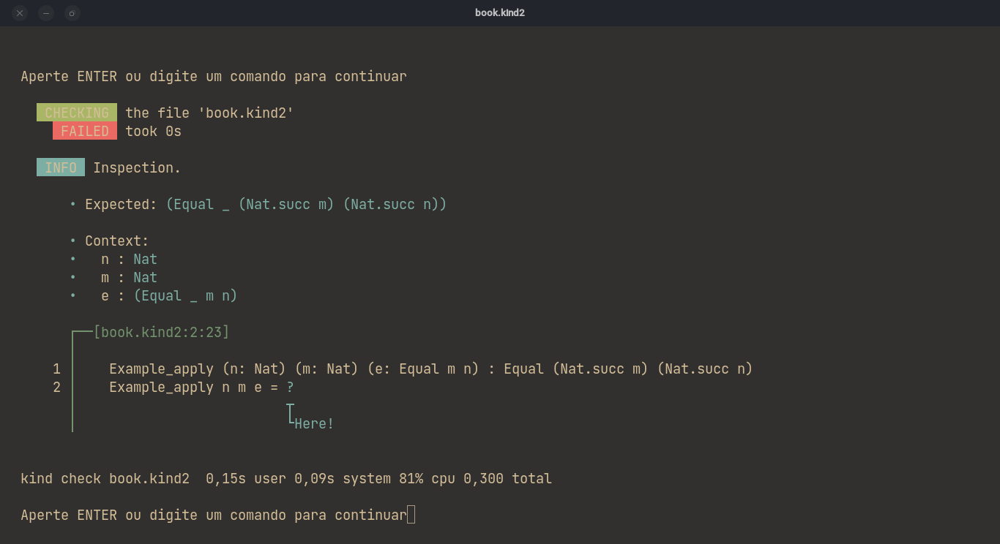
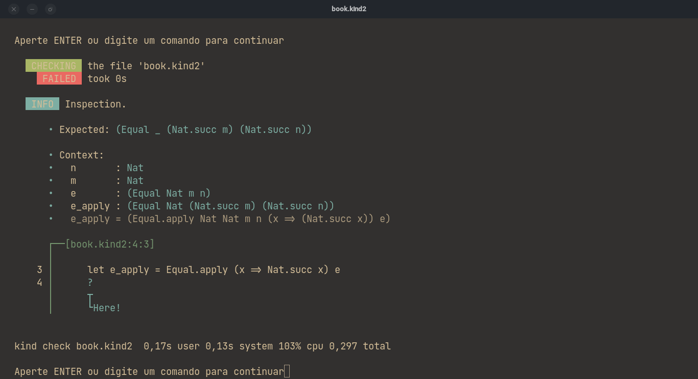
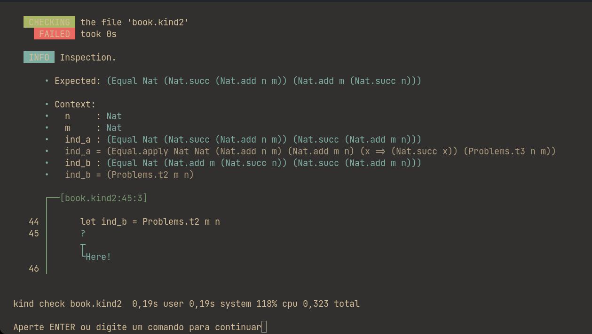

# Kind Book

## 2. Básico

### 2.1 Introdução

O estilo de programação funcional traz programação mais perto da simples e
cotidiana matemática: Se um procedimento ou método não tem efeitos colaterais,
então (ignorando eficiência) só o que precisamos entender sobre ele é como mapear
entradas para saídas - ou seja, podemos pensar nele como um método concreto que
computa uma função matemática. Esse é um dos sentidos do "funcional" em
"programação funcional". A conexão direta entre programas e objetos matemáticos
simples suporta tanto a formalidade de provas de corretude quanto a racionalização
informal sobre o comportamento do programa.

O outro sentido na qual programação funcional é "funcional" é que ela enfatiza
o uso de funções "ou métodos" como valores de primeira classe - ou seja, valores
que podem ser passados como argumentos para outras funções, retornados como
resultados, incluídos em estruturas de dados, etc. O reconhecimento de que funções
podem ser tratadas desse jeito como dados habilita uma gama de comandos úteis.

Outras funcionalidades comuns de linguagens funcionais incluem *algebraic data types*
e *pattern matching*, o que torna fácil construir e manipular estruturas de dados,
e sistemas de tipo polimórficos sofisticados, suportando abstração e reuso de código.
Kind contém todas essas funcionalidades.

A primeira metade desse capítulo introduz os elementos mais básicos da linguagem
de programação funcional Kind. A segunda metade introduz algumas técnicas básicas
que podem ser usadas para provar propriedades em programas em Kind.

### 2.2 Tipos Enumerados

Um aspecto incomum do Kind, similar a outras linguagens de prova como Idris e Coq,
é que o seu conjunto de ferramentas built-in é bastante pequeno. Por exemplo,
ao invês de fornecer o leque usual de tipos primitivos (booleanos, listas, strings, etc),
Kind tem apenas um tipo primitivo (U60: números inteiros em 60 bits binários, sem sinal)
e oferece um mecanismo poderoso para definir novos tipos de dados do zero,
do qual pode-se derivar todos esses tipos já familiares e outros.

<!-- TODO Esse bloco de texto será relevante quando tivermos um sistema de pacotes apropriado -->
<!-- Naturally, the Idris distribution comes with extensive standard libraries providing
definitions of booleans, numbers, and many common data structures like lists and
hash tables (see the prelude and contrib packages), as well as the means to write
type-safe effectful code (see the effects package) and pruvlioj, a toolkit for proof
automation and program construction. But there is nothing magic or primitive
about these library definitions. To illustrate this, we will explicitly recapitulate
all the definitions we need in this course, rather than just getting them implicitly
from the library. -->

Para demonstrar como funciona o mecanismo de definição, vamos começar com um exemplo simples.

#### 2.2.1 Dias da semana

A declaração a seguir diz para o Kind que estamos declarando um novo conjunto de dados - um Tipo.

```rust
Dia : Type // Dia é um Tipo

Dia.segunda : Dia  // Segunda é um Dia
Dia.terca   : Dia  // Terça   é um Dia
Dia.quarta  : Dia  // Quarta  é um Dia
Dia.quinta  : Dia  // Quinta  é um Dia
Dia.sexta   : Dia  // Sexta   é um Dia
Dia.sabado  : Dia  // Sábado  é um Dia
Dia.domingo : Dia  // Domingo é um Dia
```

O tipo se chama `Dia`, e seus membros são `Segunda`, `Terca`, `Quarta`, etc.
A definição `<nome> : <tipo>` pode ser lida como: "nome é um tipo".
Acima temos tanto um exemplo de criar um tipo novo `Dia : Type`, quanto a de
declarar um elemento de um tipo existente `Quarta : Dia`.

Agora que temos definido o que é um Dia, podemos escrever funções que operam usando esse tipo.
Digite o seguinte:

```rust
ProximoDiaUtil (d: Dia) : Dia
```

Isso declara que temos uma função chamado `ProximoDiaUtil`, que recebe um argumento
chamado `d`, do tipo `Dia`, e retorna um `Dia`.
Continue a definição da função da seguinte forma:

```rust
ProximoDiaUtil Dia.segunda = ?
ProximoDiaUtil Dia.terca = ?
ProximoDiaUtil Dia.quarta = ?
ProximoDiaUtil Dia.quinta = ?
ProximoDiaUtil Dia.sexta = ?
ProximoDiaUtil Dia.sabado = ?
ProximoDiaUtil Dia.domingo = ?
```

O que estamos fazendo aqui é o que chamamos de *pattern matching*. Estamos
declarando como a função deve rodar para cada possibilidade da entrada `d`.
Nem sempre será necessário fazer isso, como será mostrado em exemplos mais a frente.

Por fim, complete as funções escrevendo o que cada uma deve retornar,
e use espaços para estilizar como preferir:

```rust
ProximoDiaUtil Dia.segunda = Dia.terca
ProximoDiaUtil Dia.terca   = Dia.quarta
ProximoDiaUtil Dia.quarta  = Dia.quinta
ProximoDiaUtil Dia.quinta  = Dia.sexta
ProximoDiaUtil Dia.sexta   = Dia.segunda
ProximoDiaUtil Dia.sabado  = Dia.segunda
ProximoDiaUtil Dia.domingo = Dia.segunda
```

Com a função finalizada, nós podemos checar o funcionamento dela com alguns exemplos.
O jeito principal de fazer isso em Kind é criar uma função `Main` no seu arquivo,
e rodando ele com o comando `kind2 run <file>`.

Por exemplo, se você escrever a seguinte `Main` e rodar o arquivo

```rust
Main {
  // Dois dias úteis depois do sábado
  ProximoDiaUtil (ProximoDiaUtil Sabado)
}
```

Deve ser retornado pra você algo como:

```terminal
(Dia.terca)
```

Outro jeito de testar seu código, é dizer o que esperamos que o código retorne,
por meio de uma prova:

```rust
// O terceiro dia útil depois de uma segunda é uma quinta
TesteDiaUtil : Equal Dia (ProximoDiaUtil (ProximoDiaUtil (ProximoDiaUtil Dia.segunda))) Dia.quinta
TesteDiaUtil = Equal.refl
```

Os detalhes de como provas funcionam serão explicados mais a frente. No momento,
o que precisa ser entendido disso é:

* Tem-se a constatação de que `(ProximoDiaUtil (ProximoDiaUtil (ProximoDiaUtil Dia.segunda)))` é igual a `Dia.quinta`
* Essa constatação foi nomeada `TesteDiaUtil`
* `TesteDiaUtil = Equal.refl` diz que constatação pode ser provada usando apenas simplificação nos dois lados

Para testar que essa prova (e qualquer outra prova adiante) está correta, você precisa checar o arquivo, usando o comando `kind2 check <file>`,
que deve te retornar algo como:

```terminal
All terms check.
```

### 2.3 Booleanos

Semelhantemente, podemos declarar o tipo `Bool`, para booleanos:

```rust
Bool : Type

Bool.true  : Bool
Bool.false : Bool
```

<!-- TODO mudar isso aqui caso tenhamos um gerenciador de pacotes -->
Nós estamos declarando nossos próprios booleanos só para demonstrar como fazer tudo do zero.
O Kind tem a sua implementação padrão de booleanos no pacote padrão (o [Wikind](github.com/Kindelia/Wikind)),
junto de várias outras estruturas e provas. Na verdade, no momento de escrita,
é necessário que você esteja trabalhando dentro da pasta Wikind para fazer
provas e teoremas, pois ainda não temos um gerenciador de pacote e os utilitários
de resolução de provas não são built-in.

Funções que funcionam sobre booleanos são definidas do mesmo jeito que visto anteriormente:

```rust
// Negação lógica
Notb (b: Bool) : Bool
Notb Bool.true  = Bool.false
Notb Bool.false = Bool.true

// E lógico
Andb (b1: Bool) (b2: Bool) : Bool
Andb Bool.true  b2 = b2
Andb Bool.false b2 = Bool.false

// OU lógico
Orb (b1: Bool) (b2: Bool) : Bool
Orb Bool.true  b2 = Bool.true
Orb Bool.false b2 = b2
```

As últimas duas funções demonstram como é a sintaxe do Kind para funções de
múltiplos argumentos, e também mostra que é possível fazer *pattern matching*
apenas em parte das variáveis da função, não necessariamente todas.

Os casos da última função podem ser testados exaustivamente (todas as possibilidades)
como mostrado a seguir, criando a tabela verdade da operação lógica.

```rust
TestOrb1 : Equal Bool (Orb Bool.true Bool.false) Bool.true
TestOrb1 = Equal.refl

TestOrb2 : Equal Bool (Orb Bool.false Bool.false) Bool.false
TestOrb2 = Equal.refl

TestOrb3 : Equal Bool (Orb Bool.false Bool.true) Bool.true
TestOrb3 = Equal.refl

TestOrb4 : Equal Bool (Orb Bool.true Bool.true) Bool.true
TestOrb4 = Equal.refl
```

#### *2.3.0.1 Exercício (nandb)*

Substitua o buraco "?", completando a função seguinte; então confira
se ela está correta usando as constatações a seguir
(Análogo a como foi feito para a função `Orb`).
A função retorna `Bool.true` se qualquer uma de suas entradas for `Bool.false`

```rust
Nandb (b1: Bool) (b2: Bool) : Bool
Nandb b1 b2 = ?

Test_nandb1 : Equal Bool (Nandb Bool.true Bool.false) Bool.true
Test_nandb1 = ?

Test_nandb2 : Equal Bool (Nandb Bool.false Bool.false) Bool.true
Test_nandb2 = ?

Test_nandb3 : Equal Bool (Nandb Bool.false Bool.true) Bool.true
Test_nandb3 = ?

Test_nandb4 : Equal Bool (Nandb Bool.true Bool.true) Bool.false
Test_nandb4 = ?
```

#### *2.3.0.2 Exercício (and3)*

Faça o mesmo para a função `Andb3` abaixo. Essa função deve retornar `Bool.true`
se todas as entradas forem `Bool.true`, e `Bool.false` caso contrário

```rust
Andb3 (b1: Bool) (b2: Bool) (b3: Bool) : Bool
Andb3 b1 b2 b3 = ?

Test_andb3_1 Equal Bool (Andb3 Bool.true Bool.true Bool.true) Bool.true
Test_andb3_1 = ?

Test_andb3_2 Equal Bool (Andb3 Bool.false Bool.true Bool.true) Bool.false
Test_andb3_2 = ?

Test_andb3_3 Equal Bool (Andb3 Bool.true Bool.false Bool.true) Bool.false
Test_andb3_3 = ?

Test_andb3_4 Equal Bool (Andb3 Bool.true Bool.true Bool.false) Bool.false
Test_andb3_4 = ?
```

### 2.4 Tipos de função

Todas as expressões em Kind tem um tipo, descrevendo que tipo de coisa ela computa.
Por exemplo: `Bool.true` tem tipo `Bool`, assim como `Notb Bool.true` também tem tipo `Bool`.

Funções como `Notb`, antes de receberem argumentos, também tem um tipo, tal qual `Bool.true` ou `Bool.false`.
Os seus tipos são chamados de Tipo de Função, e são denotados com setas.

`Notb`, por exemplo, seria denotado como `Bool -> Bool`, que pode ser lido como
"uma função que recebe um `Bool` como entrada, e retorna um valor de tipo `Bool`".
Similarmente, o tipo da função `Andb` é `Bool -> Bool -> Bool`, significando
"uma função que recebe dois argumentos do tipo `Bool` e retorna um valor de tipo `Bool`".

### 2.5 Módulos

<!-- TODO preencher quando tivermos sistema de módulos -->
Não temos sistema de módulos ainda :pensive:. Para usar funções de outros arquivos,
precisa-se criar um arquivo dentro do mesmo diretório (Exemplo: a pasta raiz do Wikind).

### 2.6 Números

Os tipos que definimos até agora são exemplos de tipos enumerados: suas definições
enumeram explicitamente um conjunto finito de elemento. Um jeito mais interessante
de definir um tipo é estabelecer uma coleção de *regras indutivas* descrevendo seus
elementos. Por exemplo, nós podemos definir os números naturais da seguinte maneira:

```rust
Nat : Type
Nat.zero              : Nat
Nat.succ (pred: Nat) : Nat
```

Essa definição pode ser lida como:

* `Nat.zero` é um número natural;
* `Nat.succ` é um construtor que recebe um número natural, construindo outro número natural;
  * Ou seja, se `n` é um número natural, então `(Nat.succ n)` também será.

Todo tipo definido indutivamente (Como `Nat`, `Bool` ou `Dia`) é um conjunto de expressões.
A definição de `Nat` diz como expressões do tipo `Nat` podem ser construídas:

* A expressão `Nat.zero` pertence ao conjunto dos `Nat`;
* Se `n` é uma expressão do conjunto dos `Nat`, então `(Nat.succ n)` também é uma expressão do conjunto dos `Nat`; e
* Expressões formadas dessas duas formas são as únicas que pertencem à `Nat`.

As mesmas regras se aplicam para nossas definições de `Dia` e `Bool`.
As anotações que usamos para eles são análogas à do construtor
`Nat.zero`, indicando que não recebem nenhum argumento.

Essas três condições demonstram o poder das declarações indutivas. Elas implicam
que a expressão `Nat.zero`, a expressão `(Nat.succ Nat.zero)`, a expressão
`(Nat.succ (Nat.succ Nat.zero))` e assim por diante, são do conjunto `Nat`,
enquanto outras expressões como `Bool.true`, `(Andb Bool.true Bool.false)`,
e `(Nat.succ (Nat.succ Bool.false))` não são.

Nós podemos escrever funções simples usando *pattern matching* em números naturais
da mesma forma que fizemos acima - por exemplo, a função predecessor:

```rust
Pred (n: Nat) : Nat
// Como números naturais são estritamente não-negativos,
// usamos como convenção que qualquer coisa que seria
// menor do que 0 retorna 0
Pred  Nat.zero    = Nat.zero
Pred (Nat.succ k) = k
```

O segundo pattern pode ser lido como: "se `n` tem a forma `(Nat.succ k)`
para algum k, retorne k."

```rust
MinusTwo (n: Nat) : Nat
MinusTwo  Nat.zero               = Nat.zero
MinusTwo (Nat.succ  Nat.zero)    = Nat.zero
MinusTwo (Nat.succ (Nat.succ k)) = k
```

<!-- TODO atualizar isso aqui pro sugar de números naturais, se vier a existir -->
Para evitar ter que escrever uma sequência de `Nat.succ` toda vez que você quiser
um `Nat`, é possível usar sufixo `n` ao final de número qualquer, exemplo o`5n`, que recebe um número escrito no tipo primitivo `U60` mais o sufixo `n` e retorna o `Nat` correspondente.
{...}
<!-- TODO -->

```rust
Test : Equal Nat 6n (Nat.succ (Nat.succ (Nat.succ (Nat.succ (Nat.succ (Nat.succ Nat.zero))))))
Test = Equal.refl
```

<!-- TODO conferir q eu não estou delirando nesse parágrafo -->
O construtor `Nat.succ` tem tipo `Nat -> Nat`, assim como as funções `MinusTwo`
e `Pred`. Todos eles são coisas que, ao serem aplicadas a um `Nat`, retornam
um `Nat`. A diferença essencial entre o `Nat.succ` e os outros dois, no entanto,
é que funções vem com regras de redução - por exemplo, `Pred (Nat.succ Nat.zero)`
é reduzível para `Nat.zero` - enquanto que o `Nat.succ` não. Apesar de ele ser
uma função aplicável a um argumento, ela não computa nada.

Para a maioria das definições de funções de números, só *pattern matching* não
é suficiente: nós precisaremos também de recursão. Por exemplo, para checar
que um número `n` é par, nós podemos checar recursivamente se `n-2` é par.

```rust
Evenb (n: Nat) : Bool
Evenb  Nat.zero               = Bool.true
Evenb (Nat.succ  Nat.zero)    = Bool.false
Evenb (Nat.succ (Nat.succ k)) = Evenb k
```

Nós podemos definir `Oddb` (função para checar se um número é ímpar) com uma
declaração recursiva semelhante, mas também temos uma definição mais simples
e um pouco mais fácil de trabalhar:

```rust
Oddb (n: Nat) : Bool
Oddb n = Notb (Evenb n)
```

```rust
TestOddb1 : Equal Bool (Oddb 1n) Bool.true
TestOddb1 = Equal.refl

TestOddb2 : Equal Bool (Oddb 4n) Bool.false
TestOddb2 = Equal.refl
```

Naturalmente, nós também podemos definir funções com multiplos argumentos por recursão.

```rust
Plus (n: Nat) (m: Nat) : Nat
Plus  Nat.zero    m = m
Plus (Nat.succ k) m = Nat.succ (Plus k m)
```

Somar 3n e 2n retornará 5n como esperado.
A simplificação que o Kind realiza para chegar a esse valor pode ser vizualizada assim:

```terminal
Plus (Nat.succ (Nat.succ (Nat.succ Nat.zero))) (Nat.succ (Nat.succ Nat.zero))

> Nat.succ (Plus (Nat.succ (Nat.succ Nat.zero)) (Nat.succ (Nat.succ Nat.zero)))
pela segunda regra de Plus

> Nat.succ (Nat.succ (Plus (Nat.succ Nat.zero)) (Nat.succ (Nat.succ Nat.zero)))
pela segunda regra de Plus

> Nat.succ (Nat.succ (Nat.succ (Plus Nat.zero (Nat.succ (Nat.succ Nat.zero)))))
pela segunda regra de Plus

> Nat.succ (Nat.succ (Nat.succ (Nat.succ (Nat.succ Nat.zero))))
pela primeira regra de Plus
```

A multiplicação pode ser definida usando a definição de Plus, da seguinte forma:

```rust
Mult (n: Nat) (m: Nat) : Nat
Mult  Nat.zero    m = Nat.zero
Mult (Nat.succ k) m = Plus m (Mult k m)
```

```rust
TestMult1 : Equal Nat (Mult 3n 3n) 9n
TestMult1 = Equal.refl
```

Você também pode usar *pattern matching* em duas expressões ao mesmo tempo:

```rust
Minus (n: Nat) (m: Nat) : Nat
Minus  Nat.zero     m           = Nat.zero
Minus  n            Nat.zero    = n
Minus (Nat.succ k) (Nat.succ j) = Minus k j
```

<!-- TODO conferir se wildcard no lhs já está funcionando -->
<!-- The _ in the first line is a wildcard pattern. Writing _ in a
pattern is the same as writing some variable that doesn’t get used on the
right-hand side. This avoids the need to invent a bogus variable name. -->

O função `Exp` pode ser definida usando `Mult`
(de forma análoga a como se define `Mult` usando `Plus`):

```rust
Exp (base: Nat) (power: Nat) : Nat
Exp base  Nat.zero    = Nat.succ Nat.zero
Exp base (Nat.succ k) = Mult base (Exp base k)
```

#### *2.6.0.1 Exercício (factorial)*

Lembrando da definição matemática básica de fatorial:

$$
fatorial(n) = \begin{cases}
1, & \text{se $n$} = 0\\
n * fatorial(n-1), & \text{caso contrário}
\end{cases}
$$

Traduza a função fatorial para Kind2:

```rust
Factorial (n: Nat) : Nat
Factorial n = ?
```

```rust
TestFactorial1 : Equal Nat (Factorial 3n ) 6n
TestFactorial1 = ?

TestFactorial2 : Equal Nat (Factorial 5n) 120n
TestFactorial2 = ?
```

A função `Eql` testa a igualdade entre Naturais, retornando um booleano

```rust
Eql (n: Nat) (m: Nat) : Bool
Eql  Nat.zero     Nat.zero    = Bool.true
Eql  Nat.zero    (Nat.succ j) = Bool.false
Eql (Nat.succ k)  Nat.zero    = Bool.false
Eql (Nat.succ k) (Nat.succ j) = Eql k j
```

A função `Lte` testa se o primeiro argumento é menor ou igual ao segundo,
retornando um booleano

```rust
Lte (n: Nat) (m: Nat) : Bool
Lte  Nat.zero     m           = Bool.true
Lte (Nat.succ k)  Nat.zero    = Bool.false
Lte (Nat.succ k) (Nat.succ j) = Lte k j
```

```rust
TestLte1 : Equal Bool (Lte 2n 2n) Bool.true
TestLte1 = Equal.refl

TestLte2 : Equal Bool (Lte 2n 4n) Bool.true
TestLte2 = Equal.refl

TestLte3 : Equal Bool (Lte 4n 2n) Bool.false
TestLte3 = Equal.refl
```

#### *2.6.0.2 Exercício (blt_nat)*

A função `blt_nat` testa a relação "menor que" em numeros naturais.
Em vez de criar uma nova função recursiva, defina ela usando funções previamente definidas.

```rust
Blt_nat (n: Nat) (m: Nat) : Bool
Blt_nat n m = ?
```

```rust
Test_blt_nat_1 : Equal Bool (Blt_nat 2n 2n) Bool.false
Test_blt_nat_1 = ?

Test_blt_nat_2 : Equal Bool (Blt_nat 2n 4n) Bool.true
Test_blt_nat_2 = ?

Test_blt_nat_3 : Equal Bool (Blt_nat 4n 2n) Bool.false
Test_blt_nat_3 = ?
```

### 2.7 Prova por Simplificação

Agora que definimos alguns tipos de dados e funções, vamos começar a provar propriedades
de seus comportamentos. Na verdade, já estamos fazendo isso: cada função das seções
anteriores que começa com `Test`, faz uma afirmação precisa sobre o comportamento de
alguma função para algumas entradas especificas. As provas dessas afirmações foram
sempre a mesma: use `Equal.refl` para checar que ambos os lados são de fato idênticos.

O mesmo tipo de "prova por simplificação" pode ser usada para provar propriedades mais interessantes.
Por exemplo, o fato que o `Nat.zero` é um "elemento neutro" no lado esquerdo da
adição pode ser provado apenas observando que `Plus Nat.zero n` reduz para `n`,
independente do que é `n`, fato que pode ser lido diretamente na definição do `Plus`.

```rust
Plus_Z_n (n: Nat) : Equal Nat (Plus Nat.zero n) n
Plus_Z_n n = Equal.refl
```

Outros teoremas parecidos podem ser provados de forma parecida.

```rust
Plus_1_l (n: Nat) : Equal Nat (Plus (Nat.succ Nat.zero) n) (Nat.succ n)
Plus_1_l n = Equal.refl

Mult_0_l (n: Nat) : Equal Nat (Mult Nat.zero n) Nat.zero
Mult_0_l n = Equal.refl 
```

O `_l` indica que a prova envolve o valor no lado esquerdo. Por exemplo:
A prova da soma por 1 no lado esquerdo (`Plus_1_l`)
ou a prova da multilicação por zero no lado esquerdo (`Mult_0_l`)

Embora a simplificação seja poderosa o suficiente para provar alguns fatos gerais,
existem várias declarações que não podem ser demonstradas só com simplificação.
Por exemplo, não podemos usá-la para provar que `Nat.zero` é um elemento neutro para adição no lado direito.

```rust
Plus_n_Z (n: Nat) : Equal Nat n (Plus n Nat.zero)
Plus_n_Z n = Equal.refl
```
```diff
- ERROR Type mismatch  

   • Got      : Equal Nat n n) 
   • Expected : Equal Nat n (Plus n 0n)) 

   • Context: 
   •   n : Nat 

   Plus_n_Z n = Equal.refl
                ┬─────────
                └Here!
```

(Você consegue explicar por que isso acontece?)

O próximo capítulo vai introduzir o conceito de indução,
uma técnica poderosa que pode ser usada para demonstrar esse teorema.
Por agora, no entanto, vamos ver mais alguns tipos simples de prova.

### 2.8 Prova por aplicação

A nossa primeira ferramenta para resolver provas que não são reduzíveis de cara
será a aplicação dos dois lados. Para isso, usaremos a função `Equal.apply`, que
recebe uma igualdade (um `Equal`) e uma função, e aplica essa função dos dois lados
da igualdade, gerando uma nova igualdade.

Por exemplo:

```rust
Example_apply (n: Nat) (m: Nat) (e: Equal Nat m n) : Equal Nat (Nat.succ m) (Nat.succ n)
Example_apply n m e = ?
```

O que exatamente temos aqui? Temos uma prova que recebe como argumento uma outra
prova/igualdade. Isso quer dizer que vamos realizar a nossa prova supondo que a
prova dada como argumento também é verdadeira. Então, lendo a declaração da prova,
temos que: "Dados dois naturais, `m` e `n`, e uma prova de que eles são iguais,
provar que `Nat.succ m` e `Nat.succ n` também são iguais".

Nós aprendemos, nas nossas aulas de matématica, que aplicar uma função dos dois
lados de uma igualdade mantém a igualdade (`x/2 = 3 -> 2*x/2 = 2*3`), e podemos
ver que para provar o que a gente quer, precisamos aplicar a função `Nat.succ`
nos dois lados de `e`, usando `Equal.apply`



Como o `Equal.apply` funciona: Ele recebe como primeiro argumento a função a ser
aplicada dos dois lados, e como segundo argumento a igualdade aonde aplicar a função.
Se você não entendeu muito bem a passagem da função de argumento (`x => Nat.succ x`),
ela é o que chamamos de função lambda, e é também conhecida como função anônima.
Funções lambda são identificadas pela sua seta `=>`, sendo que do lado esquerdo
da seta fica o nome do argumento da função - use o nome que quiser - e do lado direito
fica o corpo da função: o que ela retorna. A nossa função lambda atual é uma função
que recebe um `x` qualquer e retorna `Nat.succ x`.

Podemos ver o resultado disso dando `check` no arquivo:



Como `e_apply` é uma igualdade do tipo `Equal Nat (Nat.succ m) (Nat.suuc n)`,
a prova que procuramos, é só retornar ele e concluiremos a nossa prova.

```rust
Example_apply (n: Nat) (m: Nat) (e: Equal Nat m n) : Equal Nat (Nat.succ m) (Nat.succ n)
Example_apply n m e =
  let e_apply = Equal.apply (x => Nat.succ x) e
  e_apply
```

```terminal
  All terms checked.
```

### 2.9 Prova por análise de casos

A próxima ferramenta de provas formais será análise de casos, que significa usar *pattern matching* na prova.
Por exemplo, vamos provar que o E lógico de qualquer coisa e Falso sempre é falso:

```rust
Example_case_analysis (b: Bool) : Equal Bool (Andb b1 Bool.false) Bool.false
Example_case_analysis b = ?
```

Apesar de parecer uma prova que deveria ser resolvida simplesmente com `Equal.refl`,
não é o caso. Isso é por conta de a função `Andb` fazer *pattern matching* no primeiro
argumento, e nós não temos o valor dele na prova, então ele fica "agarrado".

Para darmos um valor pra ele, e mostrar que a prova está correta para ambos os valores de `Bool`,
nós fazemos *pattern matching* na prova, criando assim duas provas diferentes:
uma pra quando `b` for `Bool.true` e uma pra quando for `Bool.false`.

```rust
Example_case_analysis (b: Bool) : Equal Bool (Andb b Bool.false) Bool.false
Example_case_analysis Bool.true  = ?
Example_case_analysis Bool.false = ?
```

E ambas essas provas são resolvivéis diretamente com `Equal.refl`, pois o *type checker*
consegue reduzir ambos para `Equal Bool.false Bool.false` direto.

```rust
Example_case_analysis (b: Bool) : Equal Bool (Andb b Bool.false) Bool.false
Example_case_analysis Bool.true  = Equal.refl
Example_case_analysis Bool.false = Equal.refl
```

<!-- TODO Reescrita no Kind2 é uma caixa de minhocas por si só,
talvez colocar mais pro final do capítulo,
ao talvez até colocar depois desse capítulo -->
### 2.10 Prova por Reescrita

Esse teorema é um pouco mais interessante que anteriores:

```rust
Plus_id_example (n: Nat) (m: Nat) (e: Equal Nat n m) : Equal Nat (Plus n n) (Plus m m)
```

Assim como mostrado anteriormente, essa é uma prova que dentro de seus argumentos temos
uma outra prova, ou hipótese: no caso, temos `Equal n m` - ou seja, `n` e `m` são iguais.

Como n e m são números arbitrários, não podemos só usar simplificação para demonstrar o teorema.
Em vez disso, nós observando que, já que assumimos `Equal n m`, poderiamos substituir `n` por `m`
no objetivo e os dois lados ficarão iguais. A função que usamos para fazer essa substituição é a `Equal.rewrite`.

<!-- TODO revisar esse parágrafo -->
Como não podemos reescrever diretamente no objetivo, nós usamos uma outra igualdade e fazemos ela ser igual ao objetivo.
No nosso caso, usaremos um `Equal.apply` em `e` para conseguir essa igualdade.

```rust
Plus_id_example (n: Nat) (m: Nat) (e: Equal Nat n m) : Equal Nat (Plus n n) (Plus m m)

Plus_id_example n m e =
  let app = Equal.apply (k => Plus k n) e
  ? 
```
```diff
+ INFO  Inspection.

   • Expected: Equal Nat (Plus n n) (Plus m m)) 

   • Context: 
   •   n   : Nat 
   •   m   : Nat 
   •   e   : Equal Nat n m) 
   •   app : Equal Nat (Plus n n) (Plus m n)) 
   •   app = Equal.apply Nat Nat n m (k => (Plus k n)) e) 
    
   let app = Equal.apply (k => Plus k n) e
      ?
      ┬
      └Here!
```

Esse `app` será do tipo `Equal (Plus n n) (Plus m n)`, como mostrado no comentário.
Com isso feito, precisamos trocar o `n` por `m` no lado direito da igualdade, e pra isso usamos o rewrite:

```rust
Plus_id_example (n: Nat) (m: Nat) (e: Equal Nat n m) : Equal Nat (Plus n n) (Plus m m)
Plus_id_example n m e =
  let app = Equal.apply (k => Plus k n) e
  let rrt = Equal.rewrite e (x => Equal (Plus n n) (Plus m x)) app
  rrt
```
```diff  
+ INFO  Inspection.

   • Expected: Equal Nat (Plus n n) (Plus m m)) 

   • Context: 
   •   n   : Nat 
   •   m   : Nat 
   •   e   : Equal Nat n m) 
   •   app : Equal Nat (Plus n n) (Plus m n)) 
   •   app = Equal.apply Nat Nat n m (k => (Plus k n)) e) 
   •   rrt : Equal Nat (Plus n n) (Plus m m)) 
   •   rrt = Equal.rewrite Nat n m e (x => Equal Nat (Plus n n) (Plus m x))) app) 
```

O retorno da operação `Equal.rewrite` já será a prova que precisamos,
então só retornamos direto o resultado da função.

#### *Exercício 2.10.0.1 (plus_id_exercise)*

Prove que:

```rust
Plus_id_exercise (n: Nat) (m: Nat) (o: Nat) (e1: Equal Nat n m) (e2: Equal Nat m o) : Equal Nat (Plus n m) (Plus m o)
Plus_id_exercise n m o e1 e2 = ?
```

### 2.11 `Equal.chain` e `Equal.mirror`

Nessa parte não falaremos de nenhuma ferramenta inerentemente nova,
mas sim de alguns utilitários de provas para facilitar o uso das ferramentas anteriores.

Imagine o exemplo:

```rust
Example_mirror (a: Nat) (b: Nat) (e: Equal Nat a b) : Equal Nat b a
```

Parece um exemplo trivial. Se `a` é igual a `b`, `b` é igual a `a`, correto?
Apesar de correto, o *type checker* do Kind não reconhece essa igualdade, pois para ele, a ordem é importante.
Para esse tipo de situação, temos a função `Equal.mirror`, que simplesmente troca os lados de uma igualdade.

```rust
Example_mirror (a: Nat) (b: Nat) (e: Equal Nat a b) : Equal Nat b a
Example_mirror a b e = 
   let mir = Equal.mirror e
   mir
```
```diff
+ INFO  Inspection.

   • Expected: Equal Nat b a) 

   • Context: 
   •   a   : Nat 
   •   b   : Nat 
   •   e   : Equal Nat a b) 
   •   mir : Equal Nat b a) 
   •   mir = Equal.mirror Nat a b e) 
```

Apesar de não parecer muito útil no momento, essa operação é muito útil para nosso segundo utilitário: `Equal.chain`.
`Equal.chain` é um caso específico do `Equal.rewrite`, no qual você reescreve um lado inteiro de uma igualdade usando outra.

```rust
Example_chain (a: Nat) (b: Nat) (c: Nat) (e1: Equal Nat b (Plus a a)) (e2 : Equal Nat c (Plus a a)) : Equal Nat b c
```

Como nós já conhecemos o `Equal.rewrite`, poderiamos usar ele para resolver esse teorema, mas ao invês disso vamos usar o `Equal.chain`.
`Equal.chain` funciona "encadeando" duas igualdades que tenham a mesma expressão no lado direito da primeira igualdade e no lado esquerdo da segunda,
"grudando" essas igualdades pela expressão em comum, gerando uma nova igualdade com as outras duas expressões (`Equal.chain (a=b) (b=c) = (a=c)`).
Por exemplo, no nosso exemplo, o lado direito das duas igualdades é igual. Se usarmos `Equal.mirror` em uma delas, podemos dar `Equal.chain` nelas:

```rust
Example_chain (a: Nat) (b: Nat) (c: Nat) (e1: Equal Nat b (Plus a a)) (e2 : Equal Nat c (Plus a a)) : Equal Nat b c
Example_chain a b c e1 e2 =
  let eql = Equal.mirror e2
  let chn = Equal.chain e1 e3

```
```diff
+ INFO  Inspection.

   • Expected: Equal Nat b c) 

   • Context: 
   •   a   : Nat 
   •   b   : Nat 
   •   c   : Nat 
   •   e1  : Equal Nat b (Plus a a)) 
   •   e2  : Equal Nat c (Plus a a)) 
   •   e3  : Equal Nat (Plus a a) c) 
   •   e3  = Equal.mirror Nat c (Plus a a) e2) 
   •   chn : Equal Nat b c) 
   •   chn = Equal.chain Nat b (Plus a a) c e1 e3) 
```
### 2.12 Mais exercícios

#### *2.12.0.1 (boolean_functions)*

Use os conhecimentos ensinados até aqui para resolver o teorema:

```rust
Identity_fn_applied_twice (f: Bool -> Bool) (e: (x: Bool) -> Equal Bool (f x) x)) (b : Bool) : Equal Bool (f (f b)) b
Identity_fn_applied_twice f e b = ?
```

Depois, resolva o teorema `negation_fn_applied_twice`, que é o mesmo que o anterior,
mas mudando a hipótese para `Equal (f x) (Not x)`

#### *2.12.0.2 (andb_eq_orb)*

Prove o seguinte teorema (Lembre-se que voce pode provar teoremas intermediários separadamente)

```rust
Andb_eq_orb (b: Bool) (c: Bool) (e: Equal Bool (Andb b c) (Orb b c)) : Equal Bool b c
Andb_eq_orb b c prf = ?
```

#### *2.12.0.3 (binary)*

Considere uma representação diferente de números naturais, usando um sistema binário ao
invês de unário. Ou seja, ao invês de termos apenas zero ou um sucessor de um número,
nós podemos ter:

* zero;
* o dobro de um número;
* o dobro de um número mais 1.

1. Primeiro, escreva uma definição indutiva desse tipo, chamando-o de `Bin`.
(Lembre-se que, no fundo, a própria definição de `Nat` como `zero` ou `succ n`
não tem sentido intríseco. Ela só diz que um elemento de `Nat` pode ser um `zero`
ou um `succ n` se `n` também for `Nat`. A interpretação disso como um sistema de valores
0, 1, 2, etc, vem de como nós trabalhamos com esse tipo `Nat`. A sua definição de `Bin`
idealmente também será tão simples quanto. Serão as funções que você fizer sobre `Bin`
que darão sentido matemático a ele).
2. Então, escreva uma função `Incr` para incrementar um `Bin`, e uma função
`Bin_to_nat` para converter de `Bin` para `Nat`.
3. Escreva cinco provas que testam suas funções de incremento e de conversão.
Note que incrementar um binário e então convertê-lo deve ser chegar no mesmo
resultado que convertê-lo primeiro e então incrementar o Nat

# CAPÍTULO 3
## Indução: Prova por Indução
### módulo de indução

Nesse capítulo nós veremos sobre provas por indução, mas antes de prosseguirmos
para a indução em si, podemos analisar casos simples onde apenas a reflexão do
caso já prova o teorema.

```rust
Problems.t0 (n: Nat) : Equal Nat (Plus Nat.zero n) n)
```

Ao verificar verificar o objetivo do teorema, recebemos a seguinte resposta:


No *Problems.t0* o Kind reduz a soma de "*0 + n*" automaticamente para *n* e
que devemos provar a igualdade entre *n* e *n*. Nesse caso basta escrever "*Equal*.**refl**" e obtemos a resposta de
confirmação: 

"*All terms check.*"

```rust
Problems.t1 (n: Nat) : Equal Nat (Plus n Nat.zero) n)
```

Feito o primeiro problema, o seguinte é muito similar, é a soma de "*n + 0 = n*" e essa similaridade pode nos levar a crer que basta invocar a reflexão. Entretanto, no primeiro caso o Kind reduz automaticamente e nesse nós obtemos o seguinte retorno:


No primeiro caso o Kind reduz pois o *zero* está à direita e o *Type
Checker* já reduz automaticamente, a soma de entre *0* e *n* para *n*.
Entretanto, quando o primeiro *input* é uma variável, o Kind necessita
verificar para cada caso e como é um número natural, há infinitos casos a serem
testatos, isto é, de zero a infinito.

De início podemos pensar que são tantos casos e que é impossível analisar todos
eles, já que são infinitos, mas logo percebemos que é possível reduzir a dois,
um é o número *zero* e o outro é um número que *sucede* o *zero* *n* vezes
depois.

Analizando para o caso de *zero* nosso objetivo é provar que *zero* é igual
a *zero*:

```rust
• Expected: Equal Nat Nat.zero Nat.zero)
```

Agora basta dar o *Equal*.**refl** e o caso zero já foi comprovado, basta
apenas responder para o *sucessor* de *zero*

Nosso objetivo é provar que para todo número *n*, ao adicionar *0* o
resultado será *n*, mas já temos uma nova ferramenta que nos auxilia nessa
prova e é a prova para o caso *zero*, basta reduzir *n* até que o
necessário seja apenas a reflexão e podemos fazer isso por meio da
recursão e para isso definimos o novo *n* como o antecessor dele. No Kind nós
podemos fazer isso simplesmente definindo o *n* atual como sendo o sucessor
do próximo *n* e chamar a função para n recursivamente. Isso é feito da
seguinte forma:

```rust
Problems.t1 (Nat.succ n)   = ?
```

e temos como novo objetivo provar que o sucessor da soma entre *n* e *0* é
igual ao sucessor de *n*

```rust
- Expected: Equal Nat (Nat.succ (Plus n Nat.zero)) (Nat.succ n))
```

Para trabalhar com a indução nessa recursão, devemos definir uma variável para
o caso original de *n*

```rust
Problems.t1 (n: Nat)       : Equal (Plus n Nat.zero) n)
Problems.t1 Nat.zero       = Equal.refl
Problems.t1 (Nat.succ n)   =
    let ind = Problems.t1 n
    ?
```

Ao dar o *Type Check* temos como retorno a seguinte resposta:


Ao analizar nosso objetivo e a indução, percebemos que a única diferença entre
o objetivo e a nossa variável *ind* é o *Nat*.**succ**, basta então
incrementar a variável *ind* com o *Nat*.**succ**, para isso nós criamos uma
nova variável e usamos uma função *lambda*:

```rust
let app = Equal.apply (x => (Nat.succ x)) ind)
```

No caso acima nós chamamos a função *Equal*.**apply** para aplicar a nossa
função *lambda* ao *ind*. A função `x => (Nat.succ x)` serve para adicionar
*Nat*.**succ** a todo elemento recebido na variável. Como nossa variável *ind*
é uma função que recebe uma outra variável *n*, a nossa função *lambda*
incrementa a *n* com *Nat*.**succ**, o que retorna exatamente o nosso
objetivo:


Podemos perceber que o *app* é exatamente igual ao *Expected*, que é o nosso
objetivo e basta apenas retornar ele, o app para que o *Type Check* valide
a nossa prova:
*All terms check.*

Há casos em que a indução é ainda mais simples, basta compreender o que está acontecendo. Imagine que você quer provar que um número `n` menos ele mesmo é igual a *zero*, independente de qual seja esse número. Como faríamos?
Primeiro, nós verificamos para o caso dele ser *zero* e é uma igualdade verdadeira, *zero* menos *zero* é igual a *zero*. Depois, nós induzimos o caso para o caso de *zero*, que sabemos ser verdadeiro. Parece complicado? Não é, é absurdamente simples, vamos ver como fica isso em *Kind*:

```rs
Minus_diag (n: Nat)     : Equal Nat (Minus  n n) Nat.zero
Minus_diag Nat.zero     = Equal.refl
Minus_diag (Nat.succ n) = Minus_diag n
```

Perceba, essa é uma indução simples, nós falamos que a prova vale para o número e o antecessor dele e, por usarmos uma recursão, para todos os antecessores até *zero*, que é o caso que verificamos ser verdadeiro.
Ou seja, provamos, em apenas três linhas, que um número natural menos ele mesmo sempre dará *zero*, independente de qual for esse número.

#### 1.0.1 Exercícios 
Prove o seguinte usando indução. Você pode precisar de resultados previamente comprovados.

```rust
Mult_0_r (n: Nat) : Equal Nat (Mult n Nat.zero) Nat.zero
Mult_0_r n = ?

Plus_n_sm (n: Nat) (m: Nat) : Equal Nat (Nat.succ (Plus n m)) (Plus n (Nat.succ m))
Plus_n_sm n m = ?

Plus_comm (n: Nat) (m: Nat) : Equal Nat (Plus n m) (Plus m n)
Plus_comm n m = ?

Add_0_r (n: Nat) : Equal Nat (Plus n Nat.zero) n
Add_0_r n = ?

Plus_assoc (n: Nat) (m: Nat) (p: Nat) : Equal Nat (Plus n (Plus m p)) (Plus (Plus n m) p)
Plus_assoc n m p = ?
```

#### 1.0.2
Considere a seguinte função que dobra o argumento recebido
```rust
Double (n: Nat)     : Nat
Double Nat.zero     = Nat.zero
Double (Nat.succ n) = Nat.succ (Nat.succ (Double n))
```

Use indução para provar esses seguintes teoremas sobre *Double*:
```rust
Double_plus (n: Nat) : Equal Nat (Double n) (Plus n n)
Double_plus n = ?
```

#### 1.0.3
Alguns teoremas é necessário analisar a melhor forma de se provar, por exemplo, para provar que um numero é par, poderiamos provar pelo sucessor dele, mas isso nos faria ter que provar para o sucessor do succesor dele, isso faz com a que a prova de *evenb* ser mais difícil por indução, então é importante perceber quando é necessário e quando não é.
```rust
Evenb_s (n: Nat) : Equal Bool (Evenb (Nat.succ n)) (Notb  (Evenb n))
Evenb_s n = ?
```
### Outro caso

Vamos verificar se a a igualdade "n +(*m* + 1) = 1 + (*n* + *m*)" é verdadeira

Primeiro, o nosso problema:
```rust
Problems.t2 (n: Nat) (m: Nat) : Equal Nat (Plus n (Nat.succ m)) (Nat.succ(Plus n m))) 
```

Verificamos o primeiro caso, quando *n* é zero:
```rust
Problems.t2 Nat.zero m = Equal.refl
```

e partimos para o caso seguinte
```rust
Problems.t2 (Nat.succ n) m = ?
```

e o nosso objetivo atual vira:
```rust
• Expected: Equal Nat (Nat.succ (Plus n (Nat.succ m))) (Nat.succ (Nat.succ (Plus n m))))
```

Traduzindo, o sucessor da adição de *n* e o sucessor de *m* é igual ao
sucessor do sucessor da adição de *n* e *m*. Para resolver esse problema,
invocaremos a indução:
```rust
let ind = Problems.t2 n m
```

e o nosso objetivo atual é provar que:
```rust
• Expected: Equal Nat (Nat.succ (Plus n (Nat.succ m))) (Nat.succ (Nat.succ (Plus n m))))
```

Traduzindo novamente, que o *sucessor* da adição de *n* e o *sucessor* de *m* é igual ao *sucessor* do *sucessor* da adição de *n* e *m*. 

mas agora nós temos uma ferramenta muito útil, a nossa variável ind que é:
```rust
Equal Nat (Plus n (Nat.succ m)) (Nat.succ (Plus n m)))
```

Ora, analisando o nosso objetivo e a nossa variável ind, podemos perceber que
basta dar um *Nat*.**succ** em ambos os lados da indução e ela ficará
exatamente igual ao nosso objetivo, para isso usaremos uma função
*lambda*:
```rust
let app = Equal.apply (x => (Nat.succ x)) ind)
```

E a nossa variável *app* retornará o nosso objetivo:
```rust
Equal Nat (Nat.succ (Plus n (Nat.succ m))) (Nat.succ (Nat.succ (Plus n m))))
```

Bastando apenas retornar o *app* para e o Kind nos retornará o tão almejado
*All terms check*.


## Usando outros teoremas

Em Kind, como na matemática informal, grandes provas são frequentemente divididas em uma sequência de
teoremas, com provas posteriores referindo-se a teoremas anteriores. Mas às vezes uma prova
exigirá algum fato variado que é muito trivial e de muito pouco geral
interesse em dar-lhe o seu próprio nome de nível superior. Nesses casos, é conveniente
ser capaz de simplesmente enunciar e provar o “sub-teorema” necessário exatamente no ponto
onde é usado.

Analisemos o seguinte teorema da comutação da adição: 
```rust
Problems.t3 (n: Nat) (m: Nat) : Equal Nat (Plus n  m) (Plus m n))
```
No primeiro caso, para *n* e *m* igual a zero nós temos uma reflexão:
```rust
Problems.t3 Nat.zero Nat.zero = Equal.refl
```
Então partimos para o próximo caso:
```rust
Problems.t3 (Nat.succ n) m = ?
```

E aqui parece que temos um novo problema: 
```rust
Expected: Equal Nat (Nat.succ (Plus n m)) (Plus m (Nat.succ n)))
```
Ao analisar o problema, percebemos que dentro dele há um teorema já provado, de
que o *sucessor* da adição de dois números é igual a adição de um número com o
*sucessor* dele, então podemos usar isso ao nosso
favor.

Começaremos aplicando um *Nat*.**succ** no nosso problema original:
```rust
let ind_a = Equal.apply (x => (Nat.succ x)) (Problems.t3 n m ))
```

Depois invocaremos nosso problema já resolvido, o *Problems*.**t2**:
```rust 
let ind_b = Problems.t2 m n
```

Ao dar o *Type Check*, o terminal nos retorna:



Agora podemos perceber que a primeira parte da *ind_a* é igual ao inverso da
primeira parte do nosso
objetivo e a primeira parte da *ind_b* é igual a segunda do objetivo, basta
apenas organizar e juntar as partes necessárias. Para isso usaremos a
*Equal*.**mirror** e a *Equal*.**chain**.
```rust
let ind_c = Equal.chain ind_b Equal.mirror ind_a)
```

E o ind_c nos retorna um valor similar ao desejado:
```rust
• Expected: Equal Nat (Nat.succ (Plus n m)) (Plus m (Nat.succ n)))
•   ind_c : Equal Nat (Plus m (Nat.succ n)) (Nat.succ (Plus n m)))
```

Podemos perceber que um é o outro espelhado, para torná-los iguais, usaremos o
*Equal*.**mirror** novamente:
```rust
let app = Equal.mirror ind_c
```

Ao chamar o *app* o *Type Check* nos retorna a mensagem *All terms checked* e
desta forma provamos, por meio da indução e usando uma outra prova, a comutação
da adição, ou seja, que a soma de *n* e *m* é igual a soma de *m* e *n*.
 
### 3 Mais exercícios
#### 3.0.1
Você pode usar a *rewrite* ou *chain* nessa prova, escolha o que achar mais fácil
```rust
Plus_swap (n: Nat) (m: Nat) (p: Nat) : Equal Nat (Plus n (Plus m p)) (Plus m (Plus n p))
Plus_swap n m p = ?
```

Agora prove a comutatividade da multiplicação. (Você provavelmente precisará definir e provar um teorema auxiliar separado para ser usado na prova deste. Você pode descobrir que *Plus_swap* é útil.

```rust
Mult_comm (n: Nat) (m: Nat) : Equal Nat (Mult n m) (Mult m n)
Mult_comm n m = ?
```

#### 3.0.2
Pegue um pedaço de papel. Para cada um dos teoremas a seguir, primeiro pense se (a) pode ser provado usando apenas simplificação e reescrita, (b) também requer análise de caso (destruição) ou (c) também requer indução. Anote sua previsão.
Em seguida, preencha a prova. (Não há necessidade de entregar seu pedaço de papel; isso é apenas para incentivá-lo a refletir antes de hackear!)

```rust
Lte_refl (n: Nat) : Equal Bool Bool.true (Lte n n)
Lte_refl n = ?

Zero_nbeq_s (n: Nat) : Equal Bool (Eql (Nat.zero) (Nat.succ n)) Bool.false
Zero_nbeq_s n = ?

And_false_r (b: Bool) : Equal Bool (Andb b Bool.false) Bool.false
And_false b = ?

S_nbeq_0 (n: Nat) : Equal Bool (Eql (Nat.succ n) Nat.zero) Bool.false

Mult_1_l (n: Nat) : Equal Nat (Mult (Nat.succ Nat.zero) n) n
Mult_1_l n = ?

All3_spec (b: Bool) (c: Bool) : Equal Bool (Orb (Orb (Andb b c) (Notb  b)) (Notb  c)) Bool.true
All3_spec b c = ?

Mult_plus_distr_r (n: Nat) (m: Nat) (p: Nat) : Equal Nat (Mult (Plus n m) p) (Plus (Mult n p) (Mult m p))
Mult_plus_distr_r n m p = ?

Mult_assoc (n: Nat) (m: Nat) (p: Nat) : Equal Nat (Mult (Mult m p)) (Mult (Mult n m) p)
Mult_assoc n m p = ?
```

# Capítulo 4
## Listas: trabalhando com dados estruturados
zsh:1: command not found: book.md

A partir de agora, veremos dados estruturados, em especial as listas e pares, e que podem conter elementos de diversos tipos. Na definição do tipo, já mostraremos eles com tipos *polimórficos*, mas não se assombre, veremos sobre isso no próximo capítulo, apenas vamos ignorar o tipo e acompanhar a explicação, fará mais sentido ao decorrer do nosso estudo.

### 1. Pares de Números

Em uma definição de tipo indutivo, cada construtor pode receber qualquer número
de argumentos -- nenhum como o `Bool`, `Empty` ou um como o `*Nat*` -- e
temos o `Pair` que recebe dois argumentos (podendo ser até mesmo outros dois
pares) e retorna um tipo:
```rust
   Pair (a: Type) (b: Type) : Type
```
Os dois argumentos recebidos são transformados no primeiro componente, o `fst`, e
o segundo, o `snd`. 
```rust
   type Pair <a: Type> <b: Type> {
      new (fst: a) (snd: b)
   }  
   ```
A forma de construir um par de *Nat* é a seguinte:
```rust
Pair.new Nat Nat a b  : (Pair a b)
```
Aqui estão duas funções simples para extrair o primeiro e o segundo componentes de um par. As definições também ilustram como fazer a correspondência de padrões em dois argumentos construtores.

Exemplo 1: (Fst Nat (List Nat) (Pair 2 [1n,2n,3n])) ->  2n
```rust
Fst (pair: Pair Nat Nat) : Nat
Fst (Pair.new Nat Nat fst snd) = fst
```
Exemplo 2: (Snd Nat (List Nat) (Pair 2 [1n,2n,3n])) -> [1n,2n,3n]
```rust
Snd (pair: Pair Nat Nat) : Nat
Snd (Pair.new Nat Nat fst snd) = snd
```

### Algumas provas

Vamos tentar provar alguns fatos simples sobre pares. Se declararmos as coisas de uma maneira particular (e ligeiramente peculiar), podemos completar provas com apenas reflexividade:
```rust
Surjective_pairing (p: Pair Nat Nat) : Equal (Pair Nat Nat) p (Pair.new (Fst p) (Snd p)))
Surjective_pairing (Pair.new Nat Nat fst snd) = Equal.refl
```
Mas *Equal.***refl** não é suficiente caso a declaração seja:
```rust
Surjective_pairing (Pair.new Nat Nat fst snd) = Equal.refl
```
Já que o Kind espera
```rust
Equal (Pair Nat Nat) p (Pair.new (Fst p) (Snd p)))
```
E recebeu
```rust
Equal p p)
```
Nós devemos "expor" a estrutura interna do *par* para que o *Type Checker*
possa verificar se `p` é realmente igual a `Pair.new (Fst p) (Snd p)` 


### Execícios:

1.1
```rust
Snd_fst_is_swap (p: Pair Nat Nat )         : Equal (Pair Nat Nat) (Pair.swap Nat Nat (Pair.swap Nat Nat p)) p)
Snd_fst_is_swap (Pair.new Nat Nat fst snd) = ? 
```

1.2
```rust
Fst_swap_is_inverse (p: Pair Nat Nat) (a: Nat) (b: Nat) : Equal (Pair Nat Nat) (Pair.swap Nat Nat (Pair.new a b) ) (Pair.new b a))
Fst_swap_is_inverse p a b = ?
```

## Listas de números

Generalizando a definição de pares, podemos descrever o tipo de listas de números assim: “Uma lista ou é a lista vazia ou então um conjuto de um elemento e outra Lista", esse tipo não é composto de um `head` e uma `tail`.
```rust
List (t: Type) : Type

type List <t: Type> {
   nil
   cons (head: t) (tail: List t)
} 
```

Outra forma de construir os tipos é com a seguinte notação, usando o caso do
tilo `List`
```rust
List (a: Type) : Type
List.nil <a> : (List a)
List.cons <a> (head: a) (tail: List a) : (List a)
```
Como vamos tratar de apenas um tipo, é interessante reescrever o tipo de lista para um definido, o escolhido foi o *Nat*:
```rust
NatList : Type
NatList.nil  : NatList
NatList.cons (head: Nat) (tail: NatList) : NatList
```
ou
```rust
NatList : Type
NatList = (List Nat)
```

Podemos perceber que em ambas as notações, há um `head` e um `tail`, sendo que o
*head* recebe um elemento do tipo *Nat* e a *tail* recebe uma lista do tipo *Nat*. 

Por exemplo, uma lista de três números naturais 1n, 2n e 3n seria escrita da
seguinte forma:

`[1n, 2n, 3n]`

O Kind, entretanto, lê de outra forma:

`[1n, [2n, 3n]]`

onde o `1n` é a head e o `[2n, 3n]` é a tail. Da mesma forma, ao olhar para uma
lista de 4 elementos `[1n, 2n, 3n, 4n]`, agora veremos da seguinte forma:
 
`[1n, [2n, [3n, 4n]]]`

A lista possui o `head` `1n` e a `tail` `[2n, [3n, 4n]]`, que, por sua vez, possui a
`head` `2n` e a `tail` `[3n, 4n]` que também possui sua `head` `3n` e sua tail `4n`.

Pode parecer assustador, mas é um monstro amigável:


[fonte da imagem: http://learnyouahaskell.com/starting-out]

### 2.1 Repeat
A função repeat recebe um número *n* e um valor, retornando uma lista de tamanho *n* onde todos os elementos é o valor declarado.
```rust
// Exemplo: (Repeat 3 Bool.true) -> [True, True, True]
Repeat (x: Nat) (count: Nat) : List Nat
Repeat x Nat.zero            = List.nil Nat 
Repeat x (Nat.succ count)    = List.cons Nat x (Repeat count x)
```

### 2.2 Length
A função *length* calcula o tamanho da lista 
```rust
// Exemplo: (Length [1,2,3]) -> 3
Length (xs: List Nat) : Nat
Length (List.nil)            = Nat.zero
Length (List.cons head tail) = (Nat.succ (Length tail))
```

### 2.3 App
A função append concatena (anexa) duas listas.
```rust
App (xs: List Nat) (ys: List Nat) : List Nat
App (List.nil)            ys = ys
App (List.cons head tail) ys = List.cons Nat head (App tail ys)
```

### 2.4 Head e Tail 
 A função head retorna o primeiro elemento (a “cabeça”) da
list, enquanto tail retorna tudo menos o primeiro elemento (a “cauda”). Claro, o
lista vazia não tem primeiro elemento, então devemos tratar esse caso com um tipo *Maybe*,
recebendo um *Maybe*.**none** caso a lista seja vazia ou um *Maybe*.**some**
caso tenha um valor.
```rust
// Exemplo: (Head 0n [1n,2n,3n]) -> 1n
Head (default: Nat) (xs: List Nat) :  Nat
Head default (List.nil)            = default
Head default (List.cons head tail) = head
```
```rust
// Exemplo: (Tail Nat [1,2,3]) -> [2,3]
Tail (xs: List Nat)        : List Nat
Tail (List.nil)            = List.nil Nat
Tail (List.cons head tail) = tail
```
```rust
Test_head1 : Equal Nat (Head 0n [1n,2n,3n]) 1n
Test_head1 = Equal.refl
```
```rust
Test_head2 : Equal Nat (Head 0n List.nil) 0n
Test_head2 = Equal.refl
```
```rust
Test_head3 : Equal (List Nat) (Tail [1n, 2n, 3n]) [2n, 3n])
Test_head3 = Equal.refl
```

### 2.5 Exercícios

- 2.5.1 Complete as definições de nonzeros, oddmembers e countoddmembers abaixo. Dê uma olhada nos testes para entender o que essas funções devem fazer.

```rust
Nonzeros (xs: List Nat) : List Nat
Nonzeros xs = ?
```
```rust
Test_nonzeros : Equal (List Nat) (Nonzeros [0n,1n,0n,2n,3n,0n,0n]) [1n,2n,3n]
Test_nonzeros = ?
```
```rust
Oddmembers (xs: List Nat) : List Nat
Oddmembers xs = ?
```
```rust
Test_oddmembers : Equal (List Nat) (Oddmembers [0n,1n,0n,2n,3n,0n,0n]) [1n,3n]
Test_oddmembers = ?
```
```rust
CountOddMembers (xs: List Nat)  : Nat
CountOddMembers xs = ?
```
```rust
Test_countoddmembers1 : Equal Nat (CountOddMembers [1n,0n,3n,1n,4n,5n]) 4n)
Test_countoddmembers1 = ?
```

- 2.5.2 Complete a definição de alternate, que “compacta” duas listas em uma, alternando entre os elementos tomados da primeira lista e elementos da segunda. Veja os testes abaixo para mais exemplos específicos.

```rust
Alternate (xs: List Nat) (ys: List Nat) : List Nat
Alternate xs ys = ?
```
```rust
Test_alternate1 : Equal (List Nat) (Alternate [1n,2n,3n] [4n,5n,6n]) [1n,4n,2n,5n,3n,6n]
Test_alternate1 = ?
```
```rust
Test_alternate2 : Equal (List Nat) (Alternate [1n] [4n,5n,6n]) [1n,4n,5n,6n]
Test_alternate2 = ?
```
```rust
Test_alternate3 : Equal (List Nat) (Alternate  [1n,2n,3n] [4n]) [1n,4n,2n,3n]
Test_alternate3 = ? 
```
```rust
Test_alternate4 : Equal (List Nat) (Alternate (List.nil Nat) [20n,30n]) [20n,30n]
Test_alternate4 = ?
```

- 2.6.1 Complete as seguintes definições para as funções count, sum, add, e member das listas de naturais

```rust
Count (v: Nat) (xs: List Nat) : Nat
Count v xs = ?
```
```rust
Test_count1 : Equal Nat (Count 1n [1n,2n,3n,1n,4n,1n]) 3n
Test_count1 = ?
```
```rust
Test_count2 : Equal Nat (Count 6n [1n,2n,3n,1n,4n,1n]) 0n
Test_count2 = ?
```
```rust
Sum (xs: List Nat) (ys: List Nat) : List Nat
Sum xs ys = ?
```
```rust
Test_sum1 : Equal Nat (Count 1n (Sum [1n,2n,3n] [1n,4n,1n])) 3n
Test_sum1 = ?
```
```rust
Add (n: Nat) (xs: List Nat) : List Nat
Add n xs = ?
```
```rust
Test_add1 : Equal Nat (Count 1n (Add 1n [1n,4n,1n])) 3n
Test_add1 = ?
```
```rust
Test_add2 : Equal Nat (Count 5n (Add 1n [1n,4n,1n])) 0n
Test_add2 = ?
```
```rust
Member (v: Nat) (xs: List Nat) : Bool
Member v xs = ?
```
```rust
Test_member1 : Equal Bool (Member 1n [1n,4n,1n]) Bool.true
Test_member1 = ?
```
```rust
Test_member2 : Equal Bool (Member 2n [1n,4n,1n]) Bool.false
Test_member2 = ?
```

- 2.6.2 Aqui estão mais algumas funções de `List Nat` para você praticar. Quando remove_one é aplicado a uma lista sem o número a ser removido, ele deve retornar a mesma lista inalterada

```rust
Remove_one (v: Nat) (xs: List Nat) : List Nat
Remove_one v xs = ?
```
```rust
Test_remove_one1 : Equal Nat (Count 5n (Remove_one 5n [2n,1n,5n,4n,1n])) 0n
Test_remove_one1 = ?
```
```rust
Test_remove_one2 : Equal Nat (Count 5n (Remove_one 5n [2n,1n,4n,1n])) 0n
Test_remove_one2 = ?
```
```rust
Test_remove_one3 : Equal Nat (Count 4n (Remove_one 5n [2n,1n,5n,4n,1n,4n])) 2n
Test_remove_one3 = ?
```
```rust
Test_remove_one4 : Equal Nat (Count 5n (Remove_one 5n [2n,1n,5n,4n,5n,1n,4n])) 1n
Test_remove_one4 = ?
```
```rust
Remove_all (v: Nat) (xs: List Nat) : List Nat
Remove_all v xs = ?
```
```rust
Test_remove_all1  : Equal Nat (Count 5n (Remove_all 5n [2n,1n,5n,4n,1n])) 0n
Test_remove_all1  = ?
```
```rust
Test_remove_all2  : Equal Nat (Count 5n (Remove_all 5n [2n,1n,4n,1n])) 0n
Test_remove_all2  = ?
```
```rust
Test_remove_all3  : Equal Nat (Count 4n (Remove_all 5n [2n,1n,5n,4n,1n,4n])) 2n
Test_remove_all3  = ?
```
```rust
Test_remove_all4  : Equal Nat (Count 5n (Remove_all 5n [2n,1n,5n,4n,5n,1n,4n,5n,1n,4n])) 0n
Test_remove_all4  = ?
```
```rust
Subset (xs: List Nat) (ys: List Nat)  : Bool
Subset xs ys = ?
```
```rust
Test_subset1 : Equal Bool (Subset [1n,2n] [2n,1n,4n,1n]) Bool.true
Test_subset1 = ?
```
```rust
Test_subset2 : Equal Bool (Subset [1n,2n,2n] [2n,1n,4n,1n]) Bool.false
Test_subset2 = ?
```

### 3 Raciocínio sobre listas

Assim como os números, fatos simples sobre funções de processamento de lista podem às vezes ser provado inteiramente por simplificação. Por exemplo, a simplificação realizada por
`Equal.refl` é suficiente para este teorema...

```Rust
Nil_app (xs: List Nat) : Equal (App (List.nil Nat) xs) xs
Nil_app xs = Equal.refl
```

... isso porque o Kind "vê" o  `List.nil` e já reduz automaticamente a igualdade da mesma forma que ocorre com os números naturais, com o `Nat.zero`

Além disso, como acontece com os números, às vezes é útil realizar uma análise de caso no possíveis formas (vazias ou não vazias) de uma lista desconhecida

```rust
Tl_length_pred (xs: List Nat)         : Equal Nat (Pred (Length xs)) (Length (Tail xs))
Tl_length_pred List.nil               = Equal.refl
Tl_length_pred (List.cons head tail)  = Equal.refl
```

Caso o usuário não abra os casos e use direto o `Equal.refl`, o Kind retorna um erro de tipo:

```diff
- ERROR  Type mismatch

   • Got      : Equal Nat (Nat.pred (Length xs)) (Nat.pred (Length xs))) 
   • Expected : Equal Nat (Nat.pred (Length xs)) (Length (Tail xs))) 

   • Context: 
   •   xs : (List Nat) 

   Tl_length_pred xs = Equal.refl
                       ┬─────────
                       └Here!
```
Da mesma forma, alguns teoremas precisam de indução para suas provas. 

- 3.0.1. Micro-Sermão. Simplesmente ler scripts de prova de exemplo não o levará muito longe! É importante trabalhar os detalhes de cada um, usando Kind e pensando no que cada passo alcança. Caso contrário, é mais ou menos garantido que os exercícios não farão sentido quando você chegar a eles. ( ಠ ʖ̯ ಠ)

### 3.1. Indução em Listas.

Provas por indução sobre tipos de dados como `List` são um pouco menos familiares do que a indução de números naturais padrão, mas a ideia é igualmente simples. Cada declaração de dados define um conjunto de valores de dados que podem ser construídos usando os construtores declarados: um booleano pode ser True ou False; um número pode ser Zero ou Succ aplicado a outro número; uma lista de naturais pode ser Nil ou Cons aplicado a um número e uma lista.

Além disso, as aplicações dos construtores declarados entre si são as únicas
possíveis formas que os elementos de um conjunto definido indutivamente podem ter, e este fato
diretamente dá origem a uma maneira de raciocinar sobre conjuntos indutivamente definidos: um número
é Zero ou então é Succ aplicado a um número menor; uma lista é Nil ou então
é um Cons aplicado a algum número e a alguma lista menor; etc. Então, se tivermos e mente
 alguma proposição `p` que menciona uma lista `l` e queremos argumentar que `p` vale
para todas as listas, podemos raciocinar da seguinte forma:

- Primeiro, mostre que `p` é verdadeiro para `l` quando `l` é `Nil`.
- Então mostre que `p` é verdadeiro para `l` quando `l` é `Cons n l` para algum número `n` e alguma lista menor `l`, assumindo que `p` é verdadeiro para `l`.

Como listas maiores só podem ser construídas a partir de listas menores, eventualmente chegando a `Nil`,
esses dois argumentos juntos estabelecem a verdade de `p` para todas as listas `l`. Aqui está um
exemplo concreto:

```rust
App_assoc (xs: List Nat) (ys: List Nat) (zs: List Nat) : Equal (App (App xs ys) zs) (App xs (App ys zs))
App_assoc List.nil                               ys zs = Equal.refl
App_assoc (List.cons Nat xs.head xs.tail)        ys zs = 
  let ind = App_assoc xs.tail ys zs
  let app = Equal.apply (x => (List.cons xs.head x)) ind
  app
```

Nós recebemos três listas `xs`, `ys` e `zs` e verificamos se a concatenação da de `xs` e `ys` com  `zs` é igual a de `xs` com a de `ys` com `zs`
Para isso nós verificamos para o caso de `xs` ser uma lista vazia, então recebemos uma reflexão da contenação é entre `ys` e `zs` e basta dar um `*Equal*.**refl**`

Em seguida nós "abrimos" o `xs` para obter o `xs.tail` para a nossa indução, e recebemos como objetivo:

``` 
 • Expected: Equal (List Nat) (List.cons Nat xs.head (App (App xs.tail ys) zs)) (List.cons Nat xs.head (App xs.tail (App ys zs)))) 
```

e a nossa variável `ind` é:
``` 
 • ind: Equal (List Nat) (App (App xs.tail ys) zs) (App xs.tail (App ys zs)))
```

bastando apenas aplicar um `List.cons xs.head` em ambos os lados da igualdade para ter o objetivo final e é isso o que fazemos no `app`:

``` 
 • app : Equal (List Nat) (List.cons Nat xs.head (App (App xs.tail ys) zs)) (List.cons Nat xs.head (App xs.tail (App ys zs))))
```

*OBSERVAÇÃO* 
O Type Check nos retorna tipos `t2`, `t3` e outros gerados no mesmo estilo e podemos ignorar e até mesmo apagar na hora de comparar o retorno das variáveis como vemos no seguinte caso:

```
 • Expected: Equal (List Nat) (List.cons Nat xs.head (App (App xs.tail ys) zs)) (List.cons Nat xs.head (App xs.tail (App ys zs)))) 
 •   app   : Equal (List Nat) (List.cons Nat xs.head (App (App xs.tail ys) zs)) (List.cons Nat xs.head (App xs.tail (App ys zs))))
```

<!-- e apagando os tipos gerados e os `holes`:

```
- Expected: Equal (List) (List.cons xs.head (App (App xs.tail ys) zs)) (List.cons xs.head (App xs.tail (App ys zs))))
- app : Equal (List) (List.cons xs.head (App (App xs.tail ys) zs)) (List.cons xs.head (App xs.tail (App ys zs))))
``` -->
<!-- TODO holes --> 
Dessa forma fica mais fácil perceber que o `app` e o `Expected` são identicos, então não é necessário se assustar ao ver esses tipos gerados 

### 3.1.1 Invertendo uma lista. 

Para um exemplo um pouco mais complicado de prova indutiva sobre listas, suponha que usamos `app` para definir uma função de reversão de lista `rev`:
```rust
Rev (xs: List Nat)        : List Nat
Rev List.nil              = List.nil Nat
Rev (List.cons head tail) = App (Rev tail) [head]

Test_rev1 : Equal (List Nat) (Rev [1n,2n,3n])) [3n,2n,1n])
Test_rev1 = Equal.refl

Test_rev2 : Equal (Rev List.nil) List.nil
Test_rev2 = Equal.refl
```

### 3.2.1

Agora vamos provar alguns teoremas sobre o rev que acabamos de definir. Para algo um pouco mais desafiador do que vimos, vamos provar
que inverter uma lista não altera seu comprimento. Nossa primeira tentativa fica presa
o caso sucessor...
```rust
Rev_length_firsttry (xs: List Nat)              : Equal Nat (Length (Rev xs)) (Length xs))
Rev_length_firsttry List.nil                    = Equal.refl
Rev_length_firsttry (List.cons xs.head xs.tail) =
   let ind = Rev_length_firsttry xs.tail
   ?
```

O Type Check nos retorna o seguinte objetivo e contexto:
```diff
+ INFO  Inspection.

   • Expected: Equal Nat (Length (App (Rev tail) (List.cons Nat head (List.nil Nat)))) (Nat.succ (Length tail))) 

   • Context: 
   •   head : Nat 
   •   tail : (List Nat) 
   •   ind  : Equal Nat (Length (Rev tail)) (Length tail)) 
   •   ind  = (Rev_length_firsttry tail) 

   let ind = Rev_length_firsttry tail
      ?
      ┬
      └Here!
```

Agora nós temos que provar que o tamanho da concatenação do reverso do tail da lista e a head dela é igual ao sucessor do tamanho da tail, então precusaremos usar algumas outras provas, uma dela é que o tamanho da concatenação de duas listas é o mesmo da soma do damanho das de cada uma delas:
```rust
App_length (xs: List Nat) (ys: List Nat)  : Equal Nat (Length (App xs ys)) (Plus (Length xs) (Length ys)))
App_length List.nil ys                    = Equal.refl
App_length (List.cons xs.head xs.tail) ys =
   let ind = App_length xs.tail ys
   let app = Equal.apply (x => (Nat.succ x)) ind
   app
```

Além dessa prova, usaremos outras já provadas nos  capítulos anteriores:
```rust
Plus_n_z (n: Nat)     : Equal Nat n (Plus n Nat.zero)
Plus_n_sn (n: Nat) (m: Nat) : Equal Nat (Nat.succ (Plus n m)) (Plus n (Nat.succ m))
Plus_comm (n: Nat) (m: Nat) : Equal Nat (Plus n m) (Plus m n)
```

E agora é possível provar o nosso teorema:
```rust
Rev_length (xs: List Nat)               : Equal Nat (Length (Rev xs)) (Length xs)
Rev_length List.nil                     = Equal.refl
Rev_length (List.cons Nat head tail)  =
   let ind   = Rev_length tail
   ?
```
```diff
+ INFO  Inspection.

   • Expected: Equal Nat (Length (App (Rev tail) (List.cons Nat head (List.nil Nat)))) (Nat.succ (Length tail))) 

   • Context: 
   •   head : Nat 
   •   tail : (List Nat) 
   •   ind  : Equal Nat (Length (Rev tail)) (Length tail)) 
   •   ind  = (Rev_length tail) 

   let ind   = Rev_length tail
      ?
      ┬
      └Here!
```

Nós criamos uma variavel com nossa auxiliar `App_length`:
```rust
Rev_length (xs: List Nat)             : Equal Nat (Length (Rev xs)) (Length xs)
Rev_length List.nil                   = Equal.refl
Rev_length (List.cons Nat head tail)  =
   let ind  = Rev_length tail
   let aux1 = App_length (Rev xs.tail) [xs.head]
   ?
```
Recebemos um novo contexto para nos auxiliar, o 
```
 • aux1: Equal Nat (Length (App (Rev tail) (List.cons Nat head (List.nil Nat)))) (Plus (Length (Rev tail)) 1n))
```

A `aux1` é igual ao lado esquerdo do nosso `Expected`, então metade do trabalho já foi resolvido, basta o outro lado da igualdade e para isso nós criamos uma nova variável, a `aux2`:
```rust 
let aux2 = Plus_comm (Length (Rev xs.tail)) (1n)
```

Agora nosso contexto está ainda melhor: 
```rust
 • aux2: Equal Nat (Plus (Length (Rev tail)) 1n) (Nat.succ (Length (Rev tail)))) 
```

Como estamos progredindo nas provas formais, é possível perceber que o lado esquerdo da `aux2` é igual ao direito da `aux1` e podemos encadear um no outro com o `Equal.chain`:
```rust
let chn = Equal.chain aux1 aux2
```

Ao dar o Type Check, vemos nosso novo contexto:

```Terminal
 • chn : Equal Nat (Length (App (Rev tail) (List.cons Nat head (List.nil Nat)))) (Nat.succ (Length (Rev tail))))
```

Nossa variável `chn` é praticamente identica ao nosso `Expected` só diferindo na parte final, pois `Expected` espera um `Nat.succ (Length xs.tail)` e o `chn` nos dá `Nat.succ (Length (Rev xs.tail))`, mas nós temos a variável `ind` que nos retorna essa igualdade. Vamos relembrar:

```Terminal
 • ind: Equal Nat (Length (Rev tail)) (Length tail)) 
```

Incrivel, não é? Ela nos retorna exatamente o que precisamos, que o tamanho do reverso da `tail` é igual ao tamanho da `tail`, então basta reescrever a variável `ind` na nossa `chn`:
```rust
let rrt = Equal.rewrite ind (x => Equal Nat (Length (App (Rev tail) (List.cons head (List.nil)))) (Nat.succ x ))) chn
```
Vamos ver nosso novo contexto, apenas ocultando os tipos para uma leitura mais fácil:
```diff
+ INFO  Inspection.

   • Expected: Equal Nat (Length (App (Rev tail) (List.cons _ head (List.nil _)))) (Nat.succ (Length tail))) 

   • Context: 
   •   head : Nat 
   •   tail : (List Nat) 
   •   ind  : Equal Nat (Length (Rev tail)) (Length tail)) 
   •   ind  = (Rev_length tail) 
   •   aux1 : Equal Nat (Length (App (Rev tail) (List.cons Nat head (List.nil Nat)))) (Plus (Length (Rev tail)) 1n)) 
   •   aux1 = (App_length (Rev tail) (List.cons Nat head (List.nil Nat))) 
   •   aux2 : Equal Nat (Plus (Length (Rev tail)) 1n) (Nat.succ (Length (Rev tail)))) 
   •   aux2 = (Plus_comm (Length (Rev tail)) 1n) 
   •   chn  : Equal Nat (Length (App (Rev tail) (List.cons Nat head (List.nil Nat)))) (Nat.succ (Length (Rev tail)))) 
   •   chn  = Equal.chain Nat (Length (App (Rev tail) (List.cons Nat head (List.nil Nat)))) (Plus (Length (Rev tail)) 1n) (Nat.succ (Length (Rev tail))) aux1 aux2) 
   •   rrt  : Equal Nat (Length (App (Rev tail) (List.cons Nat head (List.nil Nat)))) (Nat.succ (Length tail))) 
   •   rrt  = Equal.rewrite Nat (Length (Rev tail)) (Length tail) ind (x => Equal Nat (Length (App (Rev tail) (List.cons Nat head (List.nil Nat)))) (Nat.succ x))) chn)
```
Agora é muito mais fácil perceber que nosso `rrt` é exatamente o nosso `Expected`, então nossa prova fica assim:
```rust
Rev_length (xs: List Nat)            : Equal Nat (Length (Rev xs)) (Length xs))
Rev_length List.nil                  = Equal.refl
Rev_length (List.cons Nat head tail) =
   let ind   = Rev_length tail
   let aux1  = App_length (Rev tail) [head]
   let aux2  = Plus_comm (Length (Rev tail)) (1n)
   let chn   = Equal.chain aux1 aux2
   let rrt = Equal.rewrite ind (x => Equal Nat (Length (App (Rev tail) (List.cons head (List.nil)))) (Nat.succ x ))) chn
   rrt
```
## 3.3
#### 3.3.1
Vamos praticar um pouco mais com as listas:
```rust
App_nil_r (xs: List Nat) : Equal (App xs List.nil) xs)
App_nil_r xs = ?

App_assoc (xs: List Nat) (ys: List Nat) (zs: List Nat) : Equal (App (App xs ys) zs) (App xs (App ys zs))
App_assoc xs ys zs = ?

Rev_app_distr (xs: List Nat) (ys: List Nat) : Equal (Rev (App xs ys)) (App (Rev ys) (Rev xs)))
Rev_app_distr xs ys = ?

Rev_involutive (xs: List Nat) : Equal (Rev (Rev xs)) xs)
Rev_involutive xs = ?
```

Há uma solução curta para a próxima. Se você estiver achando muito difícil ou começar a ficar longo demais,
recue e tente procurar uma maneira mais simples.
```rust
App_assoc4 (l1: List Nat) (l2: List Nat) (l3: List Nat) (l4: List Nat) : Equal (List Nat) (App l1 (App l2 (App l3 l4))) (App (App (App l1 l2) l3) l4))
App_assoc4 l1 l2 l3 l4 = ? 
```
Um exercício sobre sua implementação de *nonzeros*:
```rust
Nonzeros_app (xs: List Nat) (ys: List Nat) : Equal (List Nat) (Nonzeros (App xs ys)) (App (Nonzeros xs) (Nonzeros ys)))
Nonzeros_app xs ys = ?
```
#### 3.3.2 
Preencha a definição de beq_NatList, que compara listas de números para igualdade. Prove que beq_NatList xs ys produz *Bool.true* para cada lista.
```rust
Beq_NatList (xs: List Nat) (ys: List Nat) : Bool
Beq_NatList xs ys = ? 

Test_beq_natlist1 : Equal Bool (Beq_list List.nil List.nil) Bool.true
Test_beq_natlist1 = ?

Test_beq_natlist2 : Equal Bool (Beq_list [1n,2n,3n] [1n,2n,3n]) Bool.true
Test_beq_natlist2 = ?

Test_beq_natlist3 : Equal Bool (Beq_list [1n,2n,3n] [1n,2n,4n]) Bool.false
Test_beq_natlist3 = ?

Beq_natlist_refl (xs: List Nat) : Equal Bool Bool.true (Beq_list xs xs)
Beq_natlist_refl xs = ?
```
### 3.4 Exercícios de Listas, parte 2
#### 3.4.1
Prove o seguinte teorema, ele ajudará você na prova seguinte
```rust
Ble_n_succ_n (n: Nat) : Equal Bool (Lte n (Nat.succ n)) Bool.true
Ble_n_succ_n n = ? 
```
Aqui estão mais alguns pequenos teoremas para provar sobre suas definições sobre listas.
```rust
Count_member_nonzero (xs: List Nat) : Equal Bool (Lte 1n (Count 1n (List.cons 1n xs))) Bool.true
Count_member_nonzero xs = ?
```

#### 3.4.2
Prove que a função *Rev* é injetiva - isto é
```rust
Rev_injective (xs: List Nat) (ys: List Nat) (e: Equal (List Nat) (Rev xs) (Rev ys)) :tail Equal (List Nat) xs ys
Rev_injective xs ys e = ?  
```
### 4 Maybe
Suponha que a gente queira escrever uma função que retorna o enésimo número de uma lista.
Nós então definimos um número que é aplicado a uma lista de naturais e então retorna o número que ocupa essa posição. Dessa forma, nós precisamos definir um número para ser retornado caso o número seja maior do que o tamanho da lista.
```rust
Nth_bad (n: Nat) (xs: List Nat)            : Nat
Nth_bad n List.nil                         = 42n // Valor arbitrário 
Nth_bad Nat.zero (List.cons head tail)     = head
Nth_bad (Nat.succ n) (List.cons head tail) = Nth_bad n tail
```
Esta solução não é tão boa: se nth_bad retornar 0, não podemos dizer se esse valor
realmente aparece na entrada sem processamento adicional. Uma alternativa melhor é
para alterar o tipo de retorno de nth_bad para incluir um valor de erro como um possível resultado.
Chamamos esse tipo *Maybe*, pois ele pode ou não ter algo, se tiver é um *Maybe.some* desse algo, se não tiver, é um *Maybe.none*.
```rust
NatMaybe : Type
NatMaybe = (Maybe Nat)
```
Podemos então alterar a definição acima de nth_bad para retornar None quando a lista for
muito curto e Some a quando a lista tem membros suficientes e aparece na posição
n. Chamamos essa nova função de nth_error para indicar que pode resultar em um erro.

Essa prova ainda serve pra nos apresentar outro recurso do Kind, expressões condicionais, o *if* e *else*
```rust
Nth_error (n: Nat) (xs: List Nat) : Maybe Nat
Nth_error n List.nil              = Maybe.none
Nth_error n (List.cons head tail) = 
  let ind = Nth_error (Pred n) tail
  Bool.if (Eql n 0n) (Maybe.some Nat head) (ind)

Test_nth_error1 : Equal (Nth_error 0n [4n,5n,6n,7n]) (Maybe.some 4n)
Test_nth_error1 = Equal.refl

Test_nth_error2 : Equal (Nth_error 3n [4n,5n,6n,7n]) (Maybe.some 7n)
Test_nth_error2 = Equal.refl

Test_nth_error3 : Equal (Nth_error 9n [4n,5n,6n,7n]) Maybe.none
Test_nth_error3 = Equal.refl
```
<!-- TODO -->
```rust
Extract (d: Nat) (o: Maybe Nat) : Nat
Extract d (Maybe.some k)        = k
Extract d (Maybe.none)          = d
```

#### 4.0.1

```rust
Head_error (xs: List Nat) : Maybe Nat
Head_error xs = ?

Test_head_error1 : Equal (Head_error List.nil) Maybe.none
Test_head_error1 = ?

Test_head_error2 : Equal (Head_error [1n]) (Maybe.some Nat 1n)
Test_head_error2 = ?

Test_head_error3 : Equal (Head_error  [5n,6n]) (Maybe.some Nat 5n)
Test_head_error3 = ?
```

#### 4.0.2
```rust
Extract_hd (l: List Nat) (default: Nat) : Equal Nat (Head default l)  (Extract default (Head_error l))
Extract_hd l default = ?
```

# Capítulo 5
### 1 Polimorfismo
Neste capítulo, continuamos nosso desenvolvimento de conceitos básicos de programação. Nossos novos princípios essenciais são o polimorfismo (funções de abstração sobre o
tipos de dados que eles manipulam) e funções de ordem superior (funções de tratamento como dados). Começamos com o polimorfismo.

- 1.1. Listas Polimórficas.

Nos últimos dois capítulos, trabalhamos com listas polimórficas, você pode só não ter percebido. Obviamente, programas interessantes também precisam ser capazes de
manipular listas com elementos de outros tipos – listas de strings, listas de booleanos,
listas de listas, etc. Poderíamos apenas definir um novo tipo de dados indutivo para cada um deles,
por exemplo...
```rust
BoolList : Type
BoolList = (List Bool)
```

.. mas isso rapidamente se tornaria tedioso, em parte porque temos que compensar
nomes de construtor diferentes para cada tipo de dados, mas principalmente porque também
precisamos definir novas versões de todas as nossas funções de manipulação de listas (length, rev, etc.)
para cada nova definição de tipo de dados.

Para evitar toda essa repetição, o *Kind* suporta definições de tipos indutivos polimórficos.
Por exemplo, aqui está um tipo de dados de lista polimórfica e que já vimos no capítulo anterior:
```rust
List <a: Type> : Type
List.nil <a> : (List a)
List.cons <a> (head: a) (tail: List a) : (List a)
```

Esse tipo já exite no Kind e podemos perceber que ele é idententico ao BoolList , mas com um tipo `a`, esse *tipo* recebe qualquer outro tipo, seja *Nat*, *Bool*, *Maybe* e etc.
Não precisamos criar um tipo de lista para cada um dos tipos de dados, podemos usar esse que adota todas as formas existentes.

Que tipo de coisa é a própria Lista? Uma boa maneira de pensar sobre isso é que List é
uma função de Tipos para defi   nições indutivas; ou, em outras palavras, List é
uma função de Tipos para Tipos. Para qualquer tipo específico x, o tipo List x é um
conjunto indutivamente definido de listas cujos elementos são do tipo x.

Com esta definição, quando usamos os construtores Nil e Cons para construir listas,
precisamos dizer ao Kind o tipo dos elementos nas listas que estamos construindo - isto
é, que Nil e Cons agora são construtores polimórficos. Observe os tipos de
construtores:
```rust
Pair (a: Type) (b: Type) : Type
Pair.new <a> <b> (fst: a) (snd: b) : (Pair a b)
```
Nosso tipo *Pair* recebe outros dois tipos, o `a` e o `b` e retorna um par dos dois tipos. Não foi necessário definir se o par era de números naturais,
booleanos, listas, bits ou outros pares, nós deixamos a função apta a tratar todos os pares possíveis e isso é graças ao *polimorfismo*.

Agora podemos voltar e fazer versões polimórficas de todas as listas de processamento
funções que escrevemos antes. Aqui está a repetição, por exemplo:
```rust
Repeat <a: Type> (x: a) (count: Nat) : List a
Repeat a x Nat.zero                  = List.nil
Repeat a x (Nat.succ count)          = List.cons x (Repeat x count)
 ```

Tal como acontece com Nil e Contras, podemos usar repeat aplicando-o primeiro a um tipo e depois a
seu argumento de lista:
```rust
Test_repeat1 : Equal (Repeat 4n 2n) (List.cons 4n (List.cons 4n List.nil))
Test_repeat1 = Equal.refl
```

Para usar repeat para construir outros tipos de listas, simplesmente instanciamos com um parâmetro de tipo apropriado:
```rust
Test_repeat2 : Equal (Repeat Bool.false 1n) (List.cons Bool.false List.nil)
Test_repeat2 = Equal.refl
```


1.1.2 Inferência de anotação de tipo.

Vamos escrever a definição do `repeat` novamente, mas dessa vez omitindo o tipo, mas atenção, essa não é uma boa prática usar o `hole`, servirá apenas para compreender o poder do Kind e como ele pode ajudar o usuário a encontrar o que deseja.
```rust
Repeat (x: _) (count: Nat) : List _
Repeat x Nat.zero          = ?
```
Ao rodar o *Type Check* o terminal nos retorna:
```diff
+ INFO  Inspection.

   • Expected: (List _) 

   • Context: 
   •   x : _ 

   Repeat x Nat.zero = ?
                       ┬
                       └Here!
```
Para o caso do contador ser zero, que é o nosso ponto de parada, nós precisamos retornar uma lista do tipo não definido. 
Como fizemos quando nosso tipo era definido, estamos criando uma lista que não repete o termo nenhuma vez, retornamos um *List.nil*, depois nós verificamos para o caso de uma lista que repetirá o valor *count* vezes, para isso nós usaremos a recursão por meio do `Nat.succ pred`, isto é, o nosso *count* é igual ao sucessor do predecessor dele. 
```rust
Repeat x (Nat.succ count) = ?
```

E o o *Type Check* nos retorna:
```diff
+ INFO  Inspection.

   • Expected: (List _) 

   • Context: 
   •   x     : _ 
   •   count : Nat 

   Repeat x (Nat.succ count) = ?
                               ┬
                               └Here!
```
Agora basta construir a lista com o valor e chamar a função para o predecessor de count, assim construindo a lista até que chegue a zero.
```rust
Repeat (x: _) (count: Nat) : List _
Repeat x Nat.zero          = List.nil
Repeat x (Nat.succ count)  = List.cons x (Repeat x count)
```

Podemos perceber que, apesar de não definir o tipo de *x*, o *Kind* é poderoso para descobrir o tipo que é nosso x quando usamos o *hole* `_`. Embora seja possível e possa até facilitar construir uma aplicação inteira usando essa notação, não é uma boa prática, já que, a depender do caso, pode ser inferido um tipo diferente do que o desejado. É interessante sempre definir o tipo do nosso elemento, mesmo que seja um tipo polimórico. 

No primeiro caso, quando definimos o tipo `a`, já abarcamos todos os tipos possíveis, não sendo necessário o uso do hole e essa é a mágica do polimorfismo, ele nos permite usar uma mesma função para diversos tipos diferentes.

Para usar uma função polimórfica, nós precisamos passar um ou mais tipos em adição aos outros argumentos. Por exemplo, no caso do *repeat*, nós passamos o tipo `<a: Type>` e que cada elemento da nossa lista é desse tipo. Fizemos o mesmo com o tipo *Pair*, que recebia como argumento dois tipos *a* e *b*. 

Agora fica muito mais fácil compreender os exemplos que usamos no capítulo anterior, quando apresentamos funções como a de *length* e *append*:
```rust
Length <a> (xs: List a) : Nat
Length a (List.nil t)            = Nat.zero
Length a (List.cons t head tail) = (Nat.succ (Length a tail))

App <a: Type> (xs: List a) (ys: List a) : List a
App a (List.nil)                     ys = ys
App a (List.cons head tail)          ys = List.cons a head (App a tail ys)

```
Perceba, há duas notações, uma onde apenas usamos `<a>` e outra onde usamos `<a: Type>`, podemos usar qualquer uma delas, o *Kind* é capaz de compreender as duas formas, será de escolha do desenvolvedor qual ele usará e da complexidade do que será desenvolvido, uma vez que, em códigos muito complexos, talvez seja interessante deixar explícito a outros programadores o que é cada coisa.

Agora é a hora de implementar nossas funçõe com o tipo implícito, usando o `hole` e `sugar syntax`:
```rust
App_implicito (xs: List _) (ys: List _) : List _
App_implicito []                     ys = ys
App_implicito (List.cons head tail)  ys = List.cons head (App_implicito tail ys)
```
Aqui nós aprendemos mais uma coisa, o *sugar syntax* para uma lista vazia e que é apenas `[] `e isso poderia nos induzir a escrever o nosso *List.cons* com `[head, tail]`, mas isso está errado, uma vez que o *head* é um elemento de um tipo e o *tail* é uma lista de elementos desse tipo e, dessa forma, estariamos fazendo uma lista de lista. Ao usar o *sugar syntax* errado, o que o *Kind* esperaria seria:
```bash
- Expected: (List t3_)
- Detected: (List (List t3_))
```

Perceba, ele espera uma lista e recebe uma lista de lista, pois nós declaramos o nosso *tail* como sendo ualgo do tipo t3_ (ignore a escrita do tipo, isso ocorre porque não definimos o tipo e o Kind cria um temporário apenas para retorno da mensagem), o que faz com que ela deixe de ser uma lista, causando essa incongruência no retorno. 

Portanto, é sempre importante saber exatamente o que está sendo feito, ainda mais quando usamos *sugar syntax*, ela serve pra facilitar a nossa vida, mas pode causar alguns problemas quando usada de forma indevida e isso serve igualmente para o *hole* e tipos polimórficos nos auxiliam a excrever um programa mais seguro e, ao mesmo tempo, capaz de servir para inúmeros casos. 

Outra função que podemos reescrever é a de reverse:

```rust
Rev <a> (xs: List a) : List a
Rev a []                    = []
Rev a (List.cons head tail) = App (Rev tail) [head]

Length <a> (xs: List a) : Nat
Length a []                    = 0n
Length a (List.cons head tail) = Nat.succ (Length tail)
```

Feito isso, basta apenas provar que nossas funções são verdadeiras:

```rust
Test_rev1 : Equal (Rev [1,2,3]) [3,2,1]
Test_rev1 = Equal.refl

Test_rev2 : Equal (Rev [Bool.true]) [Bool.true]
Test_rev2 = Equal.refl

Test_length1 : Equal (Length [1,2,3]) 3n
Test_length1 = Equal.refl
```

1.1.3

Aqui estão alguns exercícios simples, assim como os do capítulo Listas, para praticar com polimorfismo. Complete as provas abaixo.

```rust
App_nil_r <a> (xs: List a) : Equal (App xs List.nil) xs
App_nil_r xs = ?

App_assoc <a> (xs: List a) (ys: List a) (zs: List a) : Equal (App xs (App ys zs)) (App (App xs ys) zs)
App_assoc xs ys zs = ?

App_length <a> (xs: List a) (ys: List a) : Equal (Length (App xs ys)) (Plus (Length xs) (Length ys))
App_length xs ys = ?
```

1.1.4

Aqui estão alguns um pouco mais interessantes...

```rust
Rev_app_distr <a> (xs: List a) (ys: List a) : Equal (Rev (App xs ys)) (App (Rev ys) (Rev xs))
Rev_app_distr xs ys = ?

Rev_involutive <a> (xs: List a) : Equal (Rev (Rev xs)) xs
Rev_involutive xs = ?
```

1.2 Pares polimórficos 

Seguindo o mesmo padrão, a definição de tipo
que demos no último capítulo para pares de números podem ser generalizados para polimórficos
pares:

```rust
type Pair <a: Type> <b: Type> {
   new (fst: a) (snd: b)
}  
```

Essa é exatamente a primeira definição de pares que vimos no capítulo anterior e, agora, podemos compreender perfeitamente o que são os tipos `a` e `b` na definição do tipo *Pair*.

Nós podemos refazer as funções de *Pares*, mas agora para tipos polimórficos:

```rust
Fst <a> <b> (pair: Pair a b) : a
Fst (Pair.new fst snd) = fst

Snd <a> <b> (pair: Pair a b) : b
Snd (Pair.new fst snd) = snd
```

A seguinte função recebe duas listas e combina elas numa lista de pares. Nas linguagens funcionais, isso é comumente chamada de *Zip*. 

```rust
Zip <a> <b> (xs: List a) (ys: List b) : (List (Pair a b))
Zip [] ys = []
Zip xs [] = []
Zip (List.cons xs.h xs.t) (List.cons ys.h ys.t) = List.cons (Pair.new xs.h xs.t) (Zip xs.t ys.t)
```

Exercício 1.2.1
Sem rodar o programa, tente responder a seguinte pergunta:
- O que a combinação de [1, 2] e [Bool.true, Bool.false, Bool.false, Bool.true] retornará? 
 
Agora rode o código e veja se acertou. 

Exercício 1.2.2
A função *Split* é o inverso da *Zip*, ela recebe uma lista de pares e retorna um par de listas. Em muitas linguagens funcionais ela é chamada de *Unzip*. 

Preencha a definição de divisão abaixo. Certifique-se de que ela passe no teste unitário fornecido.

```rust
Split <a> <b> (xs: List (Pair a b)) : Pair (List a) (List b)
Split xs = ?

Test_split : Equal (Split [(Pair.new 1 Bool.false), (Pair.new 2 Bool.false)]) (Pair.new ([1, 2]) ([Bool.false, Bool.false]))
Test_split = ?
```

Exercício 1.2.3 
Maybe polimórfico. No capítulo anterior, nós também vimos o tipo *Maybe*, só que para tipos naturais, entretanto, como vimos no capítulo atual, nossas estruturas de dados podem ser polimórficas, o que significa que o tipo *Maybe* também é polimórfico e é isso o que veremos agora.

```rust
Maybe <a: Type> : Type
Maybe.none <a> : (Maybe a)
Maybe.some <a> (value: a) : (Maybe a)
```

Dessa forma, podemos escrever a função do *enésimo* erro para ele ser usado com todos os tipos de listas:

```rust
Nth_error <a> (n: Nat) (xs: List a) : Maybe a
Nth_error a n List.nil              = Maybe.none
Nth_error a n (List.cons head tail) =
  let ind = Nth_error (Pred n) tail
  Bool.if (Eql n 0n) (Maybe.some head) (ind)


Test_nth_error1 : Equal (Nth_error 0n [4n,5n,5n,7n]) (Maybe.some 4n)
Test_nth_error1 = Equal.refl

Test_nth_error2 : Equal (Nth_error 2n [Bool.true]) Maybe.none
Test_nth_error2 = Equal.refl

Test_nth_error3 : Equal (Nth_error 1n [[1n],[2n]]) (Maybe.some [2n])
Test_nth_error3 = Equal.refl

```

1.2.4
Complete a definição de
uma versão polimórfica da função hd_error do último capítulo. Certifique-se de que ele passe nos testes de unitários abaixo.

```rust
Hd_error <a> (xs: Lista a) : Maybe a
Hd_error xs = ?

Test_hd_error1 : Equal (Hd_error [1, 2]) (Maybe.some 1)
Test_hd_error1 = ?

Test_hd_error2 : Equal (Hd_error [[1], [2]]) (Maybe.some [1])
Test_hd_error2 = ?
```


### Funções como dados

Como muitas outras linguagens de programação modernas – incluindo todas as linguagens funcionais (ML, Haskell, Scheme, Scala, Clojure etc.) – o Kind trata as funções como cidadãos de primeira classe, permitindo que sejam passadas como argumentos para outras funções,
retornados como resultados, armazenados em estruturas de dados, etc.

#### 2.1 Funções de Alta Ordem (Higher-Order Functions.)

Funções que manipulam outras funções são frequentemente chamadas de funções de alta ordem (ou ainda de "ordem superior"). Aqui está um exemplo simples:

```rust
Doit3times <x> (f: x -> x) (n: x) : x
Doit3times f x = (f (f (f x)))

Test_doit3times1 : Equal (Doit3times (x => MinusTwo x) 9n) 3n
Test_doit3times1 = Equal.refl

Test_doit3times2 : Equal (Doit3times (x => Notb x) Bool.true) (Bool.false)
Test_doit3times2 = Equal.refl
```

#### 2.2 Filtro
Aqui está uma função de alta ordem mais útil, pegando uma lista de xs e um predicado em x (uma função de x para Bool) e “filtrando” a lista, retornando uma nova lista contendo apenas aqueles elementos para os quais o predicado retorna True.

```rust
Filter <x> (test: x -> Bool) (xs: List x) : List x
Filter test List.nil                      = []
Filter test (List.cons head tail)         =
   Bool.if (test head) (List.cons head (Filter test tail)) (Filter test tail)
```

Por exemplo, se aplicarmos o filtro de "é par" numa lista de números, ela nos retornará uma outra lista apena com os números pares

```rust
Test_filter1 : Equal (Filter (x => Evenb x) [1,2,3,4,5])  [2,4]  
Test_filter1 = Equal.refl

Length_is_one <x> (xs: List x) : Bool
Length_is_one xs               = Eql (Length xs) 1n

Test_filter2 : Equal (Filter (x => Length_is_one x) ([[1],[1,2],[3],[1,2,3],[21]])) ([[1],[3],[21]])
Test_filter2 = Equal.refl
```

Podemos usar filter para fornecer uma versão concisa da função countoddmembers do capítulo Listas.

```rust
CountOddMembers (xs: List Nat) : Nat
CountOddMembers xs             = Length (Filter (x => Oddb x) xs)

Test_CountOddMembers1 : Equal (CountOddMembers  [1n,0n,3n,1n,4n,5n]) 4n
Test_CountOddMembers1 = Equal.refl

Test_CountOddMembers2 : Equal (CountOddMembers  [0n 2n,4n]) 0n
Test_CountOddMembers2 = Equal.refl

Test_CountOddMembers3 : Equal (CountOddMembers []) 0n
Test_CountOddMembers3 = Equal.refl
```


#### 2.3. Funções anônimas. 
É indiscutivelmente um pouco triste, no exemplo acima, ser forçado a definir a função *Length_is_one* e dar-lhe um nome apenas para poder passá-la como um argumento para filtrar, já que provavelmente nunca a usaremos novamente.
Além disso, este não é um exemplo isolado: ao usar funções de ordem superior, muitas vezes queremos passar como argumentos funções “únicas” que nunca mais usaremos; ter que dar um nome a cada uma dessas funções seria tedioso.
Felizmente, existe uma maneira melhor. Podemos construir uma função “on the fly” sem declará-la no nível superior ou dar-lhe um nome.

```rust
Test_anon_fun : Equal (Doit3times (x => (Mult x x)) 2n) 256n
Test_anon_fun = Equal.refl
```

A expressão `x => (Mult x x)` pode ser lida como *a função recebe um número `n` e retorna `n * n`* 

Aqui está o exemplo de *Filter* reescrita pra usar uma função anonima:

```rust
Test_filter2 : Equal (Filter (x => (Length_is_one x)) [[1],[1,2],[2],[1,2,3],[21]]) [[1],[2],[21]]
Test_filter2 = Equal.refl

```

2.3.1. Exercício:(filter_even_gt7). Use *Filter* com funções anônimas (em vez de definição de função) para escrever uma função filter_even_gt7 que recebe uma lista de números naturais como entrada e retorna uma lista apenas daqueles que são pares e maiores que 7.

```rust
Filter_even_gt7 (xs: List Nat) : List Nat
Filter_even_gt7 xs = ?

Test_filter_even_gt7a: Equal (Filter_even_gt7 [1n,2n,3n,4n,5n,7n,8n,9n,10n,11n,12n]) [8n,10n,12n]
Test_filter_even_gt7a = ?

Test_filter_even_gt7b : Equal (Filter_even_gt7 [5n, 2n, 6n, 19n, 129n]) []
Test_filter_even_gt7b = ?
```

Uma pequena observação, o leitor mais atento percebeu que usamos uma nova notação, os *n* após os números, esse é um *sugar syntax* que o *Kind* possui, nós podemos escrever números naturais apenas acrescentando um *n* ao número, entretanto essa é uma sintaxe que pode acabar pesando para Kind. Imagine que o usuário pretende apenas adicionar o número *1* ao *1000000*, é um cálculo simples e que o Kind faz com uma mão nas costas, mas fica um pouco mais pesado quando usado o *sugar syntax* dos números naturais, a soma será um `Plus 1n 1000000n`, mas o *Kind* precisará verificar cada *Nat.succ* até o *um milhão e um*, ou seja, serão *um milhão e um* "Nat.succs" computados de forma desnecessárias. Essa sintaxe é bem útil, mas devemos usar com cuidado, o ideal é que para números grandes seja usado um *U60.to_nat*, que é bem mais leve para o Kind.

2.3.2 Use *Filter* para escrever uma função *Partition* em *Kind*

```rust
Partition <x> (test: x -> Bool) (xs: List x) : Pair (List x) (List x)
Partition test xs = ?
```

Dado um conjunto x, uma função de teste do tipo x -> Bool e uma Lista x, a função Partition deve retornar um par de listas. O primeiro membro do par é a sublista da lista original contendo os elementos que satisfazem o teste, e o segundo é a sublista contendo aqueles que falham no teste. A ordem dos elementos nas duas sublistas deve ser a mesma da lista original.

```rust
Test_partition1 : Equal (Partition (x => Oddb x) [1n,2n,3n,4n,5n]) (Pair.new [1n,3n,5n] [2n,4n])
Test_partition1 = ?

Test_partition2 : Equal (Partition (x => Bool.false) [5n, 9n, 0n]) (Pair.new [] [5n, 9n, 0n])

```

2.4 
Oufra função de alta ordem muito útil é a *Map*

```rust
Map <x> <y> (f: x -> y) (xs: List x)  : List y
Map f List.nil                        = List.nil
Map f (List.cons head tail)           = List.cons (f head) (Map f tail)
```

Ela recebe uma função `f` e uma lista `xs = [n1, n2, n3, ...]` e retorna a lista `[f n1, f n2, f n3, ...]`, onde `f` é aplicado a cada elemento de `xs`. Por exemplo:

```rust
Test_map1 : Equal (Map (x => Nat.add 3n x) [2n, 0n, 2n]) [5n, 3n, 5n]
Test_map1 = Equal.refl
```

Os tipos de elementos da lista de entrada e saída não precisam ser os mesmos, pois *Map* aceita dois argumentos de tipo, `x` e `y`; dessa forma pode ser aplicada uma de números para booleanos para produzir uma lista de booleanos:

```rust

Test_map2 : Equal (Map (x => Nat.is_odd x) [2n, 1n, 2n, 5n]) [Bool.false, Bool.true, Bool.false, Bool.true]
Test_map2 = Equal.refl
```
Pode até ser aplicada a uma lista de números uma função que retorne uma lista de lista de booleanos:

```rust
Test_map3 = Equal (Map (x => [(Nat.is_even x), (Nat.is_odd x)]) [2n, 1n, 2n, 5n]) [[Bool.true, Bool.false], [Bool.false, Bool.true], [Bool.true, Bool.false], [Bool.false, Bool.true]]
Test_map3 = Equal.refl
```

2.4.1
Vamos dificultar um pouco mais as coisas. Mostre a comutatividade de Rev e Map, você pode precisar de uma função auxiliar: 

```rust
Map_rev <x> <y> (f: x -> y) (xs: List x) : Equal (Map f (Rev xs)) (Rev (Map f xs))
Map_rev f xs = ?
```

2.4.2
A função *Map* mapeia uma ``List x`` para uma ``List y`` usando uma função do tipo ``x -> y``. Podemos definir uma função semelhante, `Flat_map`, que mapeia uma Lista x para uma Lista y usando uma função f do tipo ``x -> Lista y``. Sua definição deve funcionar "achatando" os resultados de f, assim:

```rust
Flat_equal : Equal (Flat_map ( x => ([x , (Nat.add x 1n), (Nat.add x 2n)])) [1n, 5n, 10n]) [1n, 2n, 3n, 5n, 6n, 7n, 10n, 11n, 12n]
Flat_equal = Equal.refl

Flat_map <x> <y> (f: x -> List y) (xs: List x) : List y
Flat_map f xs = ?

Test_flat_map1 : Equal (Flat_map (x => [x, x, x]) [1n, 5n, 4n]) [1n, 1n, 1n, 5n, 5n, 5n, 4n, 4n, 4n]
Test_flat_map1 = ?
```

As listas não são o único tipo indutivo para o qual podemos escrever uma função *Map*. Aqui está a definição de mapa para o tipo Maybe:

```rust
Maybe_map <x> <y> (f: x -> y) (a: Maybe x)  : Maybe y
Maybe_map f Maybe.none                      = Maybe.none
Maybe_map f (Maybe.some x)                  = Maybe.some (f x)
```

2.5 Fold
Uma função de ordem superior ainda mais poderosa é chamada *Fold*. Esta função é a inspiração para a operação “reduce” que está no coração da estrutura de programação distribuída map/reduce do Google.

```rust
Fold <x> <y> (f: x -> y -> y) (xs: List x) (a: y)   : y
Fold f List.nil a                                   = a
Fold f (List.cons head tail) a                      = f head (Fold f tail a)

Test_fold1 : Equal (Fold (x => y => (Bool.and x y)) [Bool.true, Bool.true, Bool.false] Bool.false) Bool.false
Test_fold1 = ?

Test_fold2 : Equal (Fold (x => y => (* x y)) [1, 2, 3, 4] 1) 24
Test_fold2 = ?

Test_fold3 : Equal (Fold (x => y => (List.concat x y)) [[1], [], [2, 3], [], [4]] [5, 6, 7]) [1, 2, 3, 4, 5, 6, 7]
Test_fold3 = ?
```

2.5.1
Observe que o tipo *Fold* é parametrizado por duas variáveis de tipo, x e y, e o parâmetro f é um operador binário que recebe um x e um y e retorna um y. Você consegue pensar em uma situação em que seria útil que x e y fossem diferentes?


2.6 Funções que constroem funções. 
A maioria das funções de ordem superior sobre as quais falamos até agora usam funções como argumentos. Vejamos alguns exemplos que envolvem o retorno de funções como resultados de outras funções. Para começar, aqui está uma função que recebe um valor x (extraído de algum tipo x) e retorna uma função de Nat para x que retorna x sempre que é chamada, ignorando seu argumento Nat

```rust
Constfun <y> (x: y) : Nat -> y
Constfun x = y => x

Ftrue : Nat -> Bool
Ftrue = Constfun Bool.true

Constfun_example1 : Equal ((Ftrue) 0n) Bool.true
Constfun_example1 = Equal.refl

Constfun_example2 : Equal ((Constfun 5n) 99n) 5n
Constfun_example2 = Equal.refl
```
<!-- Na verdade, as funções de múltiplos argumentos que já vimos também são exemplos de passagem de funções como dados. Para ver por que, lembre-se do tipo de adição -->
<!-- [>  <] -->
<!-- [> # TODO: <] -->
<!-- [>  <] -->
<!-- ```rust -->
<!-- Plus Nat -> Nat : Nat -->
<!-- ``` -->
<!-- [> Cada "->" nesta expressão é, na verdade, um operador binário em tipos. Este operador é associativo à direita, então o tipo de plus é realmente uma abreviação para Nat -> (Nat -> Nat) – ou seja, pode ser lido como dizendo que “plus é uma função de um argumento que pega um Nat e retorna uma função de um argumento que pega outro Nat e retorna um Nat.” Nos exemplos acima, sempre aplicamos mais a ambos os argumentos ao mesmo tempo, <] -->
<!-- [> mas se quisermos, podemos fornecer apenas o primeiro. Isso é chamado de aplicação parcial <] -->
<!-- [>  <] -->
<!-- [> # fim to todo <] -->
<!--  -->
```rust
Plus3 (n: Nat) : Nat
Plus3 n = Plus 3n n

Test_plus3_1 : Equal (Plus3 4n) 7n
Test_plus3_1 = Equal.refl

Test_plus3_2 : Equal (Doit3times (x => Plus3 x) 0n) 9n
Test_plus3_2 = Equal.refl

Test_plus3_3 : Equal (Doit3times (x => Plus 3n x) 0n) 9n
Test_plus3_3 = Equal.refl
```
### Exercícios adicionais
#### 3.0.1
Muitas funções comuns em listas podem ser implementado em termos de *Fold*. Por exemplo, aqui está uma definição alternativa de comprimento:

```rust
Fold_length <x> (xs: List x) : Nat
Fold_length xs = Fold (x => y Nat.succ y) xs 0n

Test_fold_length1 : Equal (Fold_length [4, 7, 0]) 3n
Test_fold_length1 = Equal.refl
```

Prove a validade de *Fold_length*:
```rust
Fold_length_correct <x> (xs: List x) : Equal (Fold_length xs) (List.length xs)
Fold_length_correct xs = ?
```

#### 3.0.2
Nós talmbém podemos definir *Map* nos termos de *Fold*. Termine a função:
```rust
Fold_map <x> <y> (f: x -> y) (xs: List x) : List y
Fold_map f xs = ?
```
Escreva um teorema fold_map_correct em Kind declarando que *Fold_map* está correto e prove isso:

```rust 
Fold_map_correct : ?
```


<!-- TODO: Currying -->


